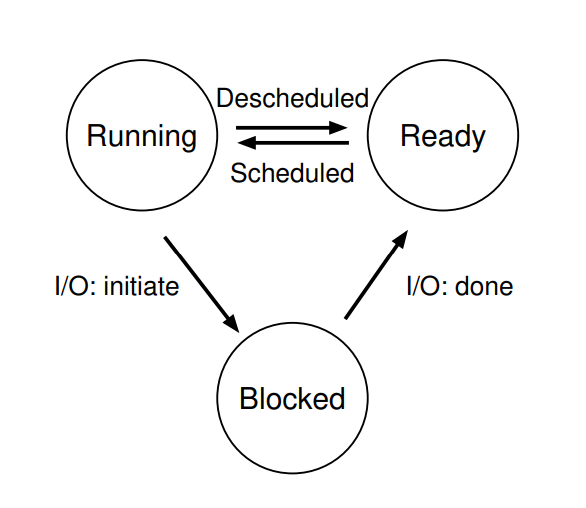
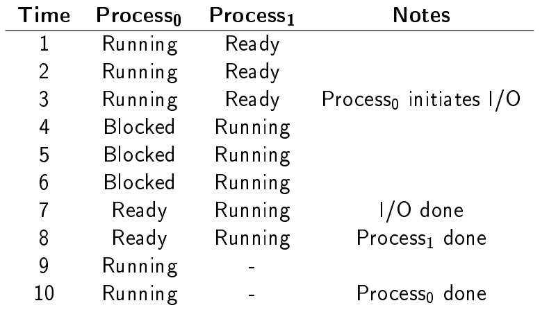
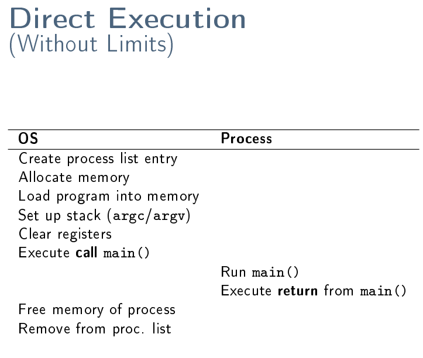
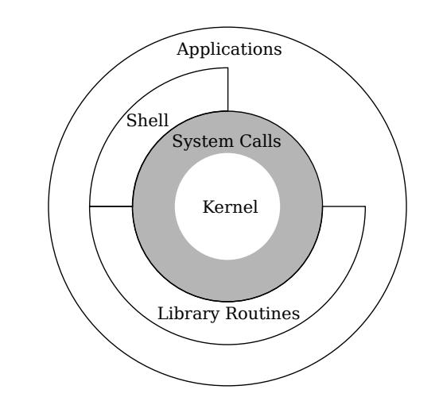

# CPU Virtualization 

- Jedes Programm muss glauben, dass es das einzige ist

- Jede Ressource ist nur 1mal verfügbar, es gibt vollen access auf eine Ressource, aber nur für einen bestimmten zeitraum

## The Process
A process a is (informally) a running instance of a program

Ein Prozess ist eine abstraktion von einem laufenden Programm und hat:
- Address space
- CPU register
    - program counter (pc) / instruction pointer
    - stack pointer
- i/o information

Ein Betriebssystem verwaltet die Prozesse

### Process Creation

- Load the program into memory: executable code and static data (i.e. initialized variables), This includes code from shared libraries
- Allocate the stack; often initialized with program arguments and environment
- Maybe preallocate some heap memory
- Init I/O
- Run the `manin()` function

### Process State

- Running: The process is running on a CPU, i.e. it is executing instructions
- Ready: The process is ready to be run. For some reasons, the OS has chosen not to run it at this given moment
- Blocked (and waiting): The process has performed some operation which makes it wait for an event to happen. Often, this is caused by an I/O request: reading data from disk or waiting for user input.

**We say that a process is being scheduled if it moves from ready to running state; descheduled if it moves from running to ready.**

## OS Data Structures

Typically, a process list ( task list ) tracks all processes present in a system.

## Limited Direct Execution

- **Direct Execution:** Processes run directly on the CPU, i.e. there is no additional abstraction layer between process and CPU (performance!)
- **Limits:** 
    - Running time
    - Ressource access
      

## What is the Kernel

Der Kernel organisiert die zugriffe auf die Hardwer welcher von den Library Routines kommt, damit es kein Chaos gibt. Auf dem Kernel dürfen keine Fehler vorkommen, sonst ist es fatal. Der Kernel ist aufs minimum reduziert. Um die Kernel-Funktionen aufzurufen, muss man im Kernel-Mode sein. Zugriff auf diese Funktionenn mit Sys-Call, dieser prüft ob die nötigen Rechte vorhanden sind

--> Folien

Es gibt nur einige Entry-Points, danach wird es gespeichert (in einem Vektor), der call wird auf dem Kernel ausgeführt, danach wieder zurück

## Context Switches

Ein Programm/Process wird durch ein anders erstezt. Ist zimlich teuer, aber nicht mega teuer, aber nicht gratis. Informationen werden gelesen und gespeichert.

- While switching to kernel mode, general purpose registers and SP/PC of the currently running process are saved on the kernel stack
- In kernel mode, they are then saved to the corresponding process structure
- A scheduling decision takes place
- The registers of the next process to run are restored from its process structure to kernel stack
- A return-from-trap takes place
- The registers are restored from kernel stack while switching to user mode

--> Folien
