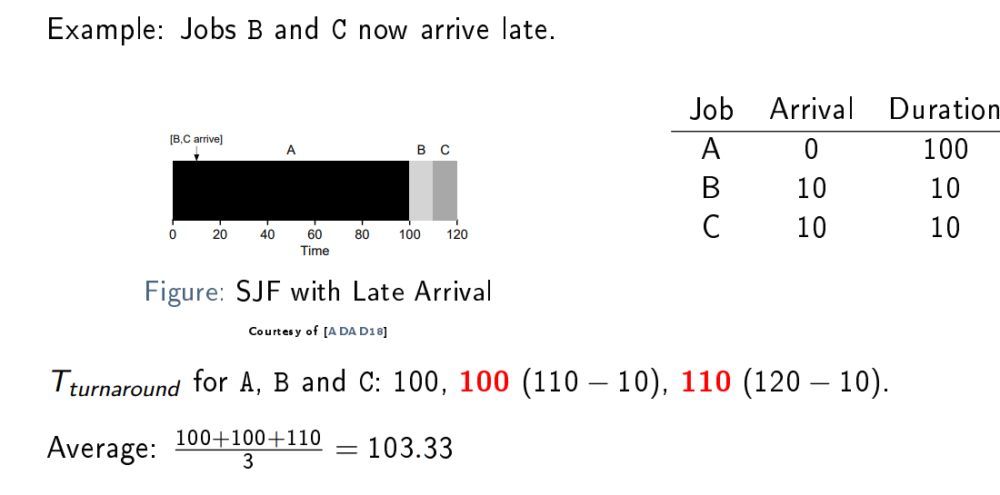
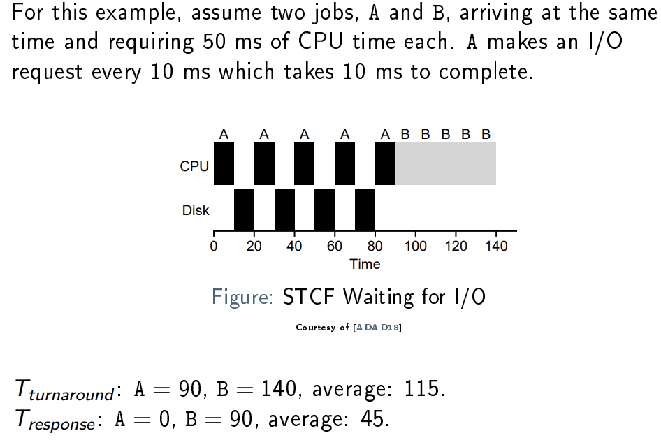
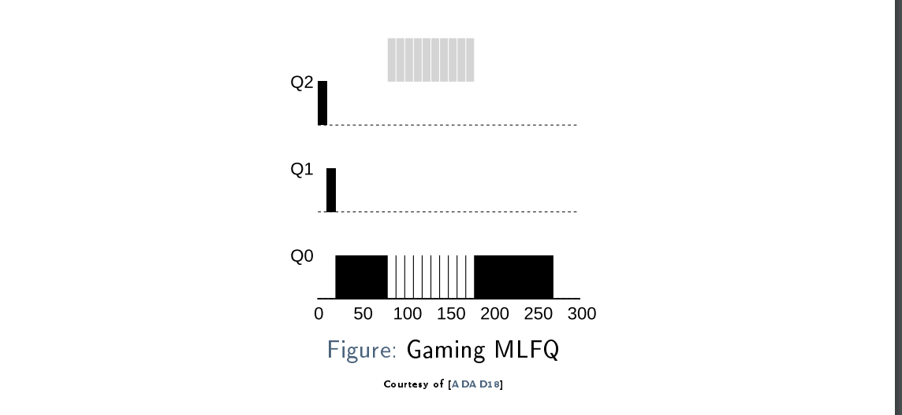
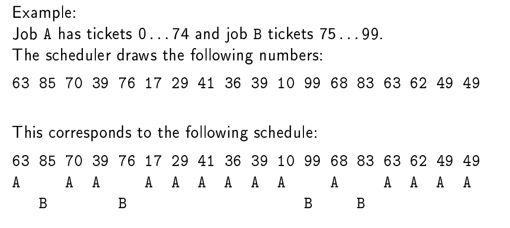
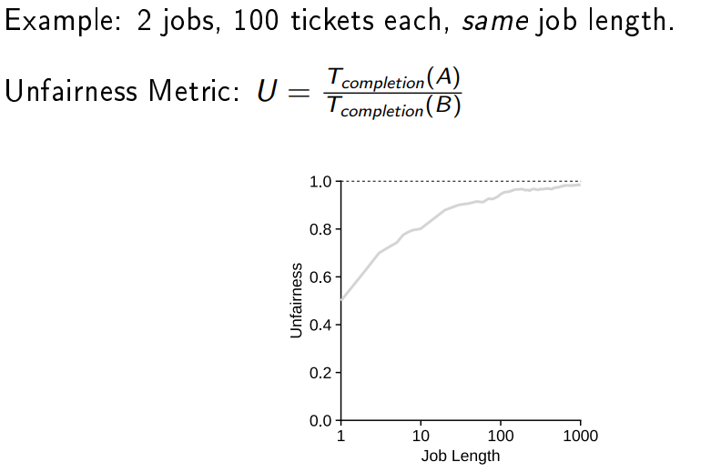

# Scheduling

## Scheduling Policies: Assumptions

1. All jobs require the same amount of time to run
2. All jobs arrive at the same time
3. When running, jobs are not interrupted until nished
4. We know exactly how long each job has to run for completion
5. They perform only work on the CPU, no I/O

## Scheduling Metric 1: Tturnaround
> Tturnaround = Tcompletion − Tarrival

The turnaround time of a job is the time when it completes minus the time at which it arrived.

## FIFO (First in First Out)
- Implementiert mit einer Queue
- Problem, wenn der erste Task lange ist, dann gibt es wartezeiten. --> Convoy Effect
    -  the whole Operating System slows down due to few slow processes

Solution:     
- Shortest Job First (SJF): Es ist bewiesen, dass dies Optimal ist. 
- Solves the Convoy Problem

Problem with SJF
- SJF nicht optimal, wenn nicht alle gleichzeitig kommen. (Wie z.B. Drucken), Es ist unrealistisch, dass immer alle jobs gelichzeitig kommen)

## Preemptive Scheduling
Erlaubt es einen grossen Job zu unterbrechen (Interrupt)

> A preemptive scheduler is a scheduler which can interrupt a
running job.

### Shortes Time-to-Completion First (STCF)
Jobs werden unterbrochen und dann wird eine anderer ausgeführt. Es Terminiert optimal  (Average Turnaround)

| Job  | Arrival    | Duration  | Tturnaround |
| ---- |------------| --------- | ---------------------- |
| A    | 0          | 100       | 120                    |
| B    | 10         | 10        | 10 (20-10)             |
| C    | 10         | 10        | 20 (30-10)             |

AVG = 50

## Scheduling Metric 2: Tresponse
If we could rely on Assumption 4 (knowing how long a job takes), STCF would be a great policy. However:
- In reality, we only rarely know the job duration
- Nowadays, systems are expected to be interactive

> Tresponse = Tfirstrun − Tarrival

The response time of a job is the difference between the time
it is first scheduled and the time at which it arrived.

### Round Robin
Do not complete jobs but run them for a time slice (or scheduling quantum ). Time slices are multiples of the timer interrupt.

- Avg Turnaround: nicht optimal
- Avg Response: optimal

Man muss herausfinden, wie "teuer" contex switching ist. Bei jedem switch geht Zeit verloren. Der optimale Slice sollte nicht zu klein sein, aber auch nicht zu gross.
- Kurzer Slice <-> mehr zeit verloren mit context switching
- Langer Slice <-> Response Time wird grösser

Amortization helps in solving this fundamental tradeoff.

### I/O

- The scheduler must schedule a dierent job when I/O starts
- When I/O finishes, the scheduler must again decide about scheduling
    - The first job
    - The currently running job
    - A different job

      
Solution: Treat CPU usage of A as individual sub-jobs. At start,
the STCF scheduler then has the choice to run A with 10 ms or B
with 50 ms job duration

Tturnaround : A = 90, B = 100, average: 95.

Tresponse : A = 0, B = 10, average: 5.

# Multi Level Feedback Queue

- Nothing is known about arrival time or duration of a job
- Achieving good turnaround- and response time simultaneously is desired but hard in practice
    - STCF would be optimal, if job duration would be known
    - Round robin is good for interactivity but terrible for turnaround time
- We have different types of workload: Batch (i.e. long running, non-interactive) and interactive jobs(i.e. browser)

MLFQ (Multi Level Feedback Queue) scheduling tries to optimize turnaround- and response time
at the same time. For this, two main ideas are applied:
1. Use more than one queue for scheduling
2. Observe the behavior of a job and adjust its priority continuously

### Basic Rules

- Es gibt eine Reihe verschiedener Warteschlangen, jede mit einer anderen Priorität
- Ein Job ist immer nur in einer Queue
- Es werden zuerst die Prozesse ausgeführt von der Queue mit der höchsten Prio, welche _ready_ sind
- Innerhalb einer Queue Round Robin, es kann mehrere Jobs pro Queue haben

* Rule 1 If Prio(A) > Prio(B): Run A
* Rule 2 If Prio(A) = Prio(B): Run A and B in round robin

## Adjusting Priority

MLFQ adjusts the priority of a job due to its observed behavior:
- A job performing a lot of I/O gets a _high_ priority
- A job using the CPU a lot gets a _low_ priority

- Rule 3 A new job is placed in the queue with the highest priority
- Rule 4a If it uses up its whole time slice, its priority is reduced
- Rule 4b If it yields the CPU before using up the time slice, its priority stays the same

-->Folien

### Problem: Starvation

Too many interactive jobs may starve a batch job.

### Solution: Priority Boost

periodically boost the priority of all jobs:

**Rule 5** After a given time period, move all jobs to the queue with the highest priority

This solves two problems at once:
- No starvation: Every job periodically runs in the queue with the highest priority
- Behavior change: A batch job can become interactive again

### Problem: Gaming

Gaming is an attack on the scheduler, in which a job cleverly yields its time slice to gain a lot of total CPU time.

### Solution: Better CPU Accounting

Rules 4a and 4b enable gaming of the scheduler.

**Rule 4** When a job uses up all its assigned time at a given priority (regardless how often it has yielded the CPU), it is moved to the next lower priority

## MLFQ Parametrization

MLFQ is an advanced scheduling policy which improves
turnaround- and response time. However, for practical
implementation, many questions must be solved:
- How many queues?
- How long are the time slices? Are they different per queue?
- At which interval should priority boosts occur?
If too long, jobs may starve; if too short, response time may
degrade. . .
- Are all jobs run in all queues? Are some queues reserved for
the OS?
- Can the user influence scheduling decisions?

# Proportional Share Scheduling

## Basic Idea

Do not optimize for turnaround or response time,
but try to guarantee a certain amount of CPU time for each job.
This is called __*proportional-share*__ or __*fair-share*__ scheduling.

One solution: Measure CPU time per job and distribute it over all
running jobs. __Diffcult to implement.__

Another idea: Use __randomness!__ This is easier to implement (needs
almost no state) and fast.

## Lottery Scheduling

In lottery scheduling , each job has a certain amount of tickets.
The percent of tickets a job has, represents its share of CPU time.
Tickets are numbered. Periodically (e.g. every time slice), a ticket
number is drawn at random and the job holding the ticket is scheduled.

### Fariness

## Stride Scheduling

Stride scheduling is a deterministic ticket-based policy. Idea: Use
inverse proportion of ticket shares to decide, which job to run. We
define:

- **Stride** S(job) = C/Tickets(job)
    - Where C is the stride constant (some large number) and Tickets(x) the number of tickets a job has
- **Pass** P(job) is the total amount of accumulated stride of a job

The scheduler then simply runs the job with the lowest pass value and increments it with the job's stride.

Problem compared to lottery scheduling: Global state (what if a new job enters?)

