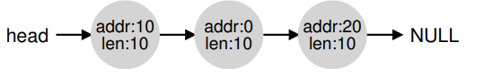

# Memory

In this part, we proceed in a similar fashion to extend limited direct execution to virtualize memory:

- Using the address space as abstraction
- Address translation as mechanism
- Segmentation and later paging as memory management schemes (policies)

- If the whole memory (besides the OS) is assigned to a process, it needs to be exchanged at every process switch
- Exchanging memory is highly ine cient (not comparable to a "normal" context switch)
- Only solution: having multiple processes simultaneously in memory

This leads to a new problem: protection is required between processes (and the OS).

## The (Virtual) Address Space

Addressen im virtual Address Space haben nicht die selbe Adresse wie die phyische Adresse.

An address space is the abstraction of physical memory as seen from a process:

- Contains its full **memory state** : code, initialized data, dynamic stack and heap etc
- Provides **virtual addresses** which normally do not correspond to physical addresses
    - Program may be loaded physically at a different address
    - Address space can be larger than physical memory
- Provides **isolation** for protection and ease of use:
    - Every process sees its own address space
    - No need to care about memory layout and other processes

## Types of Memory

`void func() { int x; // declares an integer on the stack ... }`

Meap Momory: Long lived. all allocations and deallocations are explicitly handled by you, the programmer

`
void func() { int *x = (int *) malloc(sizeof(int)); ... }`

## Goals for Address Spaces

In der Realität ist es sehr komplex

__Transparenvy__
Processes should not notice that their memory is virtualized. The OS provides the illusion that the process has access
to a large, contiguous memory space on its own.

__Flexibility__
Processes may organize their address spaces however they like.

__Effciency__
Memory virtualization must be highly e cient, as memory is accessed permanently.

__Protection__
Individual processes must be protected from each other and the OS itself also needs protection. A process must thus not
be able to access or affect foreign memory (isolation).

## Summary Address Spaces

We have seen the introduction of a major OS subsystem: virtual memory. The VM system is responsible for providing the
illusion of a large, sparse, private address space to programs, which hold all of their instructions and data therein.
The OS, with some serious hardware help, will take each of these virtual memory references, and turn them into physical
addresses, which can be presented to the physical memory in order to fetch the desired information. The OS will do this
for many processes at once, making sure to protect programs from one another, as well as protect the OS. The entire
approach requires a great deal of mechanism (lots of low-level machinery) as well as some critical policies to work;
we’ll start from the bottom up, describing the critical mechanisms first. And thus we proceed!

## Address Translation

__Virtual addresses__ as seen from the running process

__Physical addresses__ used in hardware to address physical memory

For _every_ memory access (fetching an instruction, load or store a value), a translation has to be performed. There are
two roles in this:

__OS__: Manages memory, knows which parts belong to which process and con gures the hardware.

__Hardware__:   The Memory Management Unit (MMU) provides efficient translation between virtual and physical addresses.

### Example 1

Adressen zwischen 0 und 214-1 (0000H->Kleinste Adresse 3FFFH->Grösste Adresse)

Danach Addition von Addressen: Offset + Adresse gibt die richtige Adresse: (Offset: 8000H, Adresse: 3000H --> B000H)

## Dynamic Relocation

dynamic relocation or base and bounds. The idea is simple:

- Introduce two hardware registers, called base and bounds
- Programs are compiled to start at address 0
- When loading, the OS decides upon the size and start position of the corresponding address space in physical memory
- base is set to its start address, bounds to base + size
- References to addresses higher than bounds (or negative!) lead to a fault (which has to be handled by the OS)

> Memory references are then simply translated (at run time!) as follows:  
> physical address = base + virtual address

when the OS decides to stop running a process, it must save the values of the base and bounds registers to memory

# Memory Management

External Fragmentation:

- Over time, memory regions of various sizes are allocated and subsequently deallocated
- This leads to holes in memory
- It then becomes more and more diffcult to find free regions of appropriate size for new allocations

--> Bild Folien

Internal Fragmentation:

Wenn ein Allokator größere Speicherabschnitte ausgibt als angefordert, wird jeder nicht angeforderte (und somit
ungenutzte) Speicherplatz in einem solchen Abschnitt als interne Fragmentierung betrachtet (da die Verschwendung
innerhalb der zugewiesenen Einheit stattfindet)

### Possible Solution *Compaction*

A possible solution for external fragmentation could be **compaction**.

However, in general it is *either too expensive (copying memory) or impossible (user space allocators: no controlover
assigned regions).*

## Mechanisms for Memory Management

### Splitting

findet er einen freien Speicherbereich, der die Anforderung erfüllen kann, und teilt ihn in zwei Teile auf. Das erste
Stück wird an den Aufrufer zurückgegeben; das zweite Stück verbleibt in der Liste. Wenn also in unserem obigen Beispiel
1 Byte angefordert wird und der Allokator beschließt, das zweite der beiden Elemente auf der Liste zu verwenden, um die
Anforderung zu erfüllen, würde der Aufruf von malloc() 20 zurückgeben (die Adresse des 1-Byte-Bereichs), und die Liste
würde am Ende wie folgt aussehen.

### Coalescing

Ein weiterer Mechanismus, der in vielen Allokatoren zu finden ist, ist die Zusammenlegung von freiem Speicherplatz.

Im Beispiel oben sind die alle drei Chunks frei (nach einem Free) und alle haben Länge 10. Das Problem: wenn wir nun
eine Request für 20 Bytes haben, werden wir nichts finden, obschon 30Bytes am stück frei wären

Um dieses Problem zu vermeiden, fassen Allokatoren den freien Speicher zusammen wenn ein Stück Speicher freigegeben
wird. Die Idee ist einfach: Bei der Rückgabe eines freien Chunk im Speicher zurückgeben, schauen Sie sich die Adressen
des Chunks, den Sie Wenn der neu freigegebene Speicherplatz direkt neben einem (oder zwei, wie in diesem Beispiel)
vorhandenen freien Chunks, verschmelzen Sie diese zu einem einzigen größeren freien Chunk. Mit Coalescing sollte unsere
endgültige Liste also wie folgt aussehen:

### Strategies

- Best Fit:  Search the full list for equal sized or bigger chunks and choose the smallest. Goal: space effciency.
  Problem: Performance.
- Opposite to best fit: search largest chunk and split it. Goal: keep big chunks free. Problems: Performance, excess
  fragmentation.
- First Fit:Simply take the first chunk that fits. Goal: speed. Problem: Pollution with small allocations
- Next Fit: Keep a pointer to the last allocation, then perform first fit from there. Goal: equal distribution of
  allocations. Problem: As for first fit.

Allgemein ist es schwierig zu sagen, welche Strategie am Besten ist. Es hängt vom Gebrauch und Workload ab.  
Worst Fit ist klar am Schlechtesten.

Es kann also davon ausgegangen werden, dass "first fit" in Bezug auf Leistung und Speichernutzung am besten abschneidet
und gleichzeitig eine unkomplizierte Implementierung ermöglicht.

## Buddy Allocation

Bei einer Speicheranforderung wird der freie Speicherplatz rekursiv durch zwei geteilt, bis ein Block gefunden wird, der
groß genug ist, um die Anforderung zu erfüllen (und eine weitere Zweiteilung würde zu einem zu kleinen Speicherplatz
führen)

kann durch interne Fragmentierung beeinträchtigt werden

## Segmentation

individual base and bounds registers per segment. A segment is a single, contiguous region within an address space.

> Wir habe 3x Base & Bound, für jedes Segment

--> See Example Folien --> Skizze Aufnahme (2h34:30)

### Summary

Segmentation solves a number of problems, and helps us build a more effective virtualization of memory. Beyond just
dynamic relocation, segmentation can better support sparse address spaces, by avoiding the huge potential waste of
memory between logical segments of the address space. It is also fast, as doing the arithmetic segmentation requires is
easy and well-suited to hardware; the overheads of translation are minimal. A fringe benefit arises too: code sharing.
If code is placed within a separate segment, such a segment could potentially be shared across multiple running
programs. However, as we learned, allocating variable-sized segments in memory leads to some problems that we’d like to
overcome. The first, as discussed above, is external fragmentation. Because segments are variablesized, free memory gets
chopped up into odd-sized pieces, and thus satisfying a memory-allocation request can be difficult. One can try to use
smart algorithms [W+95] or periodically compact memory, but the problem is fundamental and hard to avoid. The second and
perhaps more important problem is that segmentation still isn’t flexible enough to support our fully generalized, sparse
address space. For example, if we have a large but sparsely-used heap all in one logical segment, the entire heap must
still reside in memory in order to be accessed. In other words, if our model of how the address space is being used
doesn’t exactly match how the underlying segmentation has been designed to support it, segmentation doesn’t work very
well. We thus need to find some new solutions. Ready to find them?

### Segement Shareing

Wenn Programm mehrmals gestartet wird, dann gibt es den Code-Segment nur 1x

# Excercise

a-> auf Stack b-> statischer bereich
*pc ->heap string1->statischer bereich string2->heap

Die beiden Bonjour sind am selben Platz: immutable, selben pointer

## segmentation.py

Seg 0+ 0x1aea Limit 472

Seg1 - 0x1254 Limit 450

523 = 10 0000 1011 -> offset: 11 phy: 0x1249

414 = 01 1001 1110 = 0x19E phy: 0x1aea + 0x19E = 0x1c88

802 -> Offset = 290 (802-512)
phy: 0x1132

310 phy: 0x1c20

488 -> Violation
