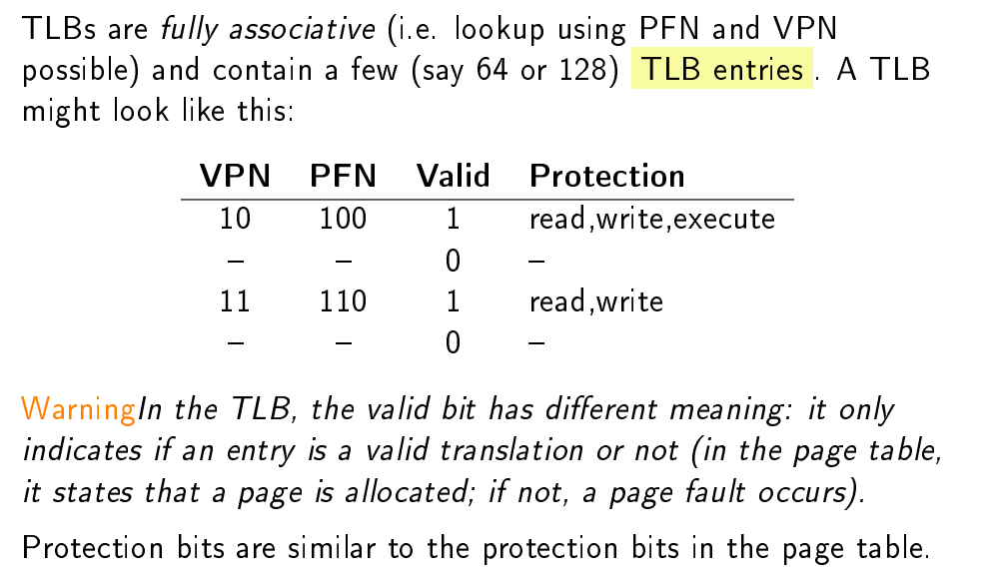
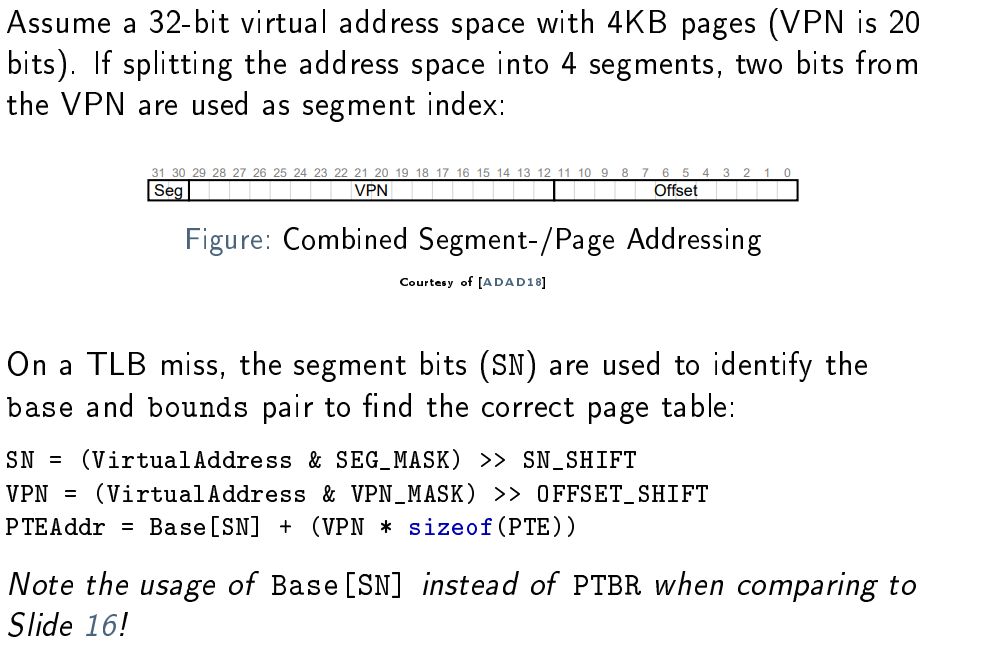
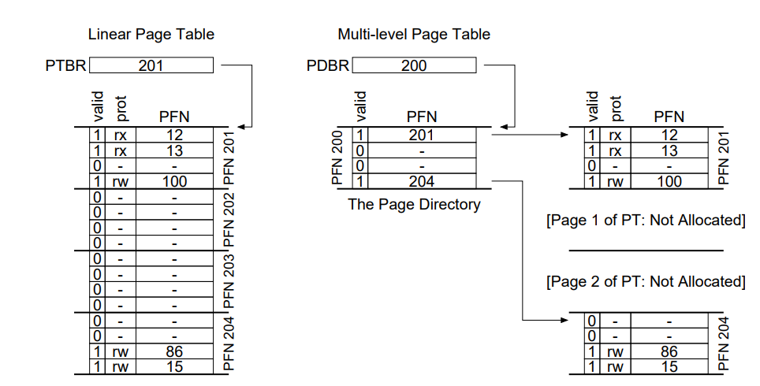

# Memory 2

## Issues with Segmentation

- Es gibt Löcher im Speicher

## Paging

- Fixe grösse (fixed-size "pieces")
- divide the physical memory into an array of fixed-size slots, which we call **page frames**.
- Page Table (Directory): Speichert welech Virual Page in welchem Page Frame ist
- Free Frames Table für alle Prozesse
- Wenn ein Prozess treminiert werden alle virtual Pages zu den Free Frames hinzugefügt

It is important to remember that this page table is a per-process data structure

### Address Translation

- Die virutal address wird in eine virtual page number (vpn) und einen offset innerhalb der Page (Bild Folie 9)
- Concatiniert zusammen geben den Offset und die Übersetzung die physical frame number (pfn)

### Page Table Storage

As pages in general are quite small, page tables tend to grow big

For example, consider pages of 4096 bytes (21^2) in an
"old-fashioned" 32 bit address space: The OS must then somehow manage 220 (≈ 10^6) address translations. 
Asssuming 4 bytes per page table entry (PTE) and 100 processes, this would require
some 400MB of memory!

### Page Table Entry (PTE)

- Ist Prozessspezifisch
- A page table base register (PTBR) points to the memory location of the table.

A PTE typically has some fields corresponding to the following:
- Valid Bit: Zeigt an, ob eine bestimmte Seite überhaupt abgebildet wird. Unterstützt die Erstellung von _sparse_ Adressräumen.
- Protection Bits: Similar to segmentation: read, write, execute. . .
- Present Bit: Used for swapping
- Reference Bit: Tracks if a page has been accessed.
- Dirty Bit: Indicates if a page has been modified.

### Basic HW Paging Algo
-> Aufnahem 01:22:30

### Tracing Memory Accesses

Virtual Address space 64KB (2^16), Page size 1KB (2^10)
VPN: 6bit
Offset: 10bit

## Paging Summary

We have introduced the concept of paging as a solution to our challenge of virtualizing memory. Paging has many advantages over previous approaches (such as segmentation). First, it does not lead to external
fragmentation, as paging (by design) divides memory into fixed-sized
units. Second, it is quite flexible, enabling the sparse use of virtual address spaces.
However, implementing paging support without care will lead to a
slower machine (with many extra memory accesses to access the page
table) as well as memory waste (with memory filled with page tables instead of useful application data). We’ll thus have to think a little harder
to come up with a paging system that not only works, but works well.
The next two chapters, fortunately, will show us how to do so.

# Translation Lookaside Buffers (TLBs)

## Fixing Paging Performance

hardware, the translation-lookaside buffer (TLB) , a cache of mappings in the MMU.

For every memory access, the MMU first checks if the required
address is in the TLB. If so, this is a TLB hit and address
translation occurs without any page table access. Otherwise, it is a
TLB miss and the PTE must be retrieved from the page table

__After a TLB miss, the PTE retrieved from memory is stored in the TLB.__

--> See Exmaple Folien 23-24

So kann eine Hitrate von 70% erreicht werden.
70 % sieht nach viel aus. In der Praxis ist jedoch eine gute TLB-Trefferquote aufgrund der Lokalität der Referenz keine Ausnahme. 3 Das ist das Hauptprinzip von Hardware-Caches!

Aufgrund der inhärenten Eigenschaften des Codes und der Art und Weise, wie die CPU ihn ausführt, treten bei Speicherzugriffen unterschiedliche Arten von Lokalität auf. Die beiden wichtigsten sind:

- Spatial (Räumlich) Loc: Es ist wahrscheinlich, dass ein anderer Zugriff auf einen Ort in der Nähe auf einen Ort in der Nähe eines kürzlich erfolgten Zugriffs erfolgt. Beispiel: Array-Zugriffe.
- Es ist wahrscheinlich, dass ein kürzlich aufgerufener Ort in naher Zukunft erneut zugegriffen wird. Beispiel: Zählervariablen.

## Handling TLB Misses

TLB misses can be handled either in hardware or in the OS:

When handled by the hardware, format of the page table is dened
by it and its location must be congured in a PTBR. --> Folie 22

TLB misses in the OS: This simplifies the addressing algorithm (see Slide 28), but complicates trap handling:
- return-from-trap after a TLB miss needs to return to the previous PC
- Infinite TLB misses must be avoided (due to TLB-miss handler address not in TLB. . . )

### TLB Contents

## TLB Context Switches

the TLB contains virtual-to-physical translations that are only valid for the currently running process

- Simply flush the TLB (i.e. mark entries as invalid) on every context switch. This could be done automatically on PTBR change or using a privileged instruction. Flushing is inefficient as it destroys state.
- By marking process affiliation in the TLB, using address space identifiers (ASID) , also called process-context identifers (PCID) . Note: This requires a separate register to indicate the currently running process.

# Multi-level Page Tables

Fixing Memory Consumption:

By introducing TLBs, the performance issues due to additional memory accesses became manageable. 

We still have the second issue though: memory consumption. Remember from Slide 13, that even moderate assumptions about the number of PTEs and their size, lead to large amounts of memory required for the page table.

As an example: For the x86 PTE given on Slide 15 and a 32 bit address space, the table requires 4MB of memory per process!

## Large/Huge Pages
A simple solution would be to increase page size.

These so-called large pages or huge pages have mainly been introduced to reduce pressure on the TLB for applications
frequently using large data structures (e.g. RDBMS). As a side effect, they also reduce page table size.

**internal fragmentation!**

## Paging and Segments

- base now holds the physical address of the page table belonging to the given segment
- bounds indicates the end of the page table (how many pages it has)

Issues:

- As discussed, segmentation is not too flexible (e.g. large but sparse heap still wastes a lot of page tables)
- **External fragmentation** (for page tables) returns, our main issue with segmentation

## Multi-level Page Tables

Another idea to get rid of all the invalid regions in the page table is to turn it in a tree-like structure, called a multi-level page table . It is used on many modern systems.

- Split the page table into page-sized chunks
    -    If the whole chunk contains no valid PTEs, don't allocate it
- Use a page directory to look up the page table chunks
    - It returns the physical location of a chunk, if it contains any valid PTEs
    - Or it indicates that the complete chunk is unused

The page directory is a simple table with one entry per chunk of the page table. It consists of page directory entries (PDE) , which at least contain the following fields:

- A valid bit, indicating if at least one page of the referenced page table chunk is valid
- The PFN of the page table chunk

A **page directory base register (PDBR)** points the MMU to its physical location.

Advantages: 

- Memory for the page table is allocated proportionally to the space used by a process (thus in general compact and supporting sparse spaces)
- As the chunks of the table t into pages themselves, managing memory for the page table is easier for the OS (it is free to place them where they t)

on a TLB miss, two loads from memory will be required to get the right translation information from the page table (one for the page directory, and one for the PTE itself), in contrast to just one load with a linear page table.

Another obvious negative is complexity. Whether it is the hardware or
OS handling the page-table lookup (on a TLB miss), doing so is undoubtedly more involved than a simple linear page-table lookup. time-space trade-off

--> Example Folien 42-47

## Inverted Page Tables
Another idea is to use inverted page tables : Instead of having one
page table per process, have a single table for all physical pages in
the system. A PTE then indicates to which process a certain page
belongs.
Inverted page tables tend to be large and require efficient strategies
for searching. They are used for example on the PowerPC
architecture.

# Exercise

## 1.1

Erste 8bit _VPN_, zweite 8bit offset

0x01cd -> _0000 0001_ 1100 1101 -> _0x01_, 0xcd

0x34ff -> _0011 0100_ 1111 1111 -> _0x34_, 0xff

0xff5c -> _1111 1111_ 0101 1100 -> _0xff_, 0x5c

0x01a0 -> _0000 0001_ 1010 0000 -> _0x01_, 0xa0

0x5689 -> _0101 0110_ 1000 1001 -> _0x56_, 0x89

## 1.2

_VPN_ , offset

0x01cd -> _0000 00_ 01 1100 1101 -> _0x0_, 0x1cd

0x34ff -> _0011 01_ 00 1111 1111 -> _0xd_, 0xff

0xff5c -> _1111 11_ 11 0101 1100 -> _0x3f_, 0x35c

0x01a0 -> _0000 00_ 01 1010 0000 -> _0x0_, 0x1a0

0x5689 -> _0101 01_ 10 1000 1001 -> _0x15_, 0x289

## 1.3

- What is the size of a page?

2^12 = 4Kib

Weil es schön aufgeht

0x01cd34ff -> 0x01, 0xcd3, 0x4ff

## 3.1 

- How many bits are used for the offset?
9bits (log2(512)=9 oder 2^9 = 512)

- How many bits are used for the virtual page number (VPN)?
16-9 = 7bits

- Suppose each virtual page entries (VPE) has a size of 4 bytes. How large is the page table?
2^7 = 128 Entries x 4 Bytes => 512Bytes => 1Page

## 3.2

Pagesize: 4096

Offset: log2(4096) = 12 bit

VPN: 48 - 12 = 26 bit

a) 2^36 * 4 Bytes ca= 275 GB
b) 275 GB * 100 ca= 27.5 TB

## 3.3

pro Page (4096 Bytes)/(4 Bytes) 1024 = 2^10

x = [aufrunden] (36 Bits VPN)/(log2(1024 Eintries pro Page)) = 4
