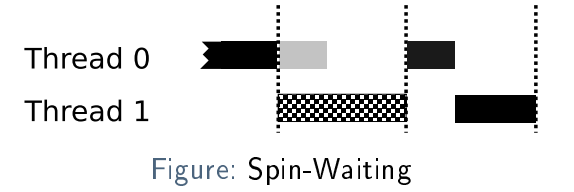
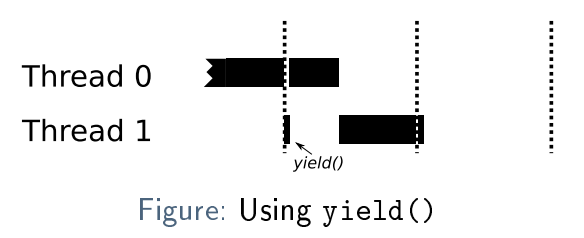

# More Locking, Condition Variables

## The Problem with Spin Locks



1. T0 ist eine critical section (lock held)
2. Es gibt einen Interrupt (z.B. Scheduling decision)
3. T1 wurde vom Scheduler ausgewählt und spin-waits auf den lock. __Er verbraucht das gesamte Scheduling quantum!__
4. T0 wird wieder scheduled und kann fertig machen
5. T1 kann nun den lock erwerben und weiterfahren

### Property Inversion

Ein anderes Problem mit spin-locks, welches die correctness betrifft:

1. Angenommen 2 Threads: TO (tiefe Prio), T1 (hohe Prio)
2. T1 ist blockiert, T0 ist scheduled
3. T0 erwirbt einen spin-lock
4. T1 wird nun unblocked und will den lock erwerben und startet zu spinnen

Da T1 eine höhere Priorität hat, wird T0 nicht mehr eingeplant und kann somit die Sperre nicht freigeben. Das System
blockiert effektiv für immer!

Das kann auch ohne spin-lock auftreten, wenn man mehrere threats mit verschiedenen Prio's haben

### First Solution `yled()`

`yield()` is simply a system call, which moves the current thread from running to ready. This allows the OS then to
schedule another thread/process without the current thread wasting its whole quantum; i.e., the thread de-schedules
itself:

````c
void init() {
    flag = 0;
}

void lock() {
    while (TestAndSet(&flag, 1) == 1)
    yield(); // <==
}

void unlock() {
    flag = 0;
}
````



Es gibt 2 Probleme mit dieser Lösung:

1. Es skaliert nicht: Z.B. bei 100 Threads müssen im schlimmsten Fall 99 zuerst yielden müssen (einschließlich eines
   Kontextwechsels jedes Mal!)
2. Es stellt keine Fariness sicher: Je nach Scheduling, könnte es vorkommen, dass ein Thread in einem endless loop immer
   wieder yielded, während andere Threads am laufen sind: Starvation

### Using Queues to Sleep

Das Problem für die Issues mit dem ``yield()`` ist der Scheduler. Er weiss nicht, wie die Threads voneinander abhängig
sind und kann so "falsche" Entscheidungen machen.

Eine queue kann benutzt werden um die Reihenfolge zu tracken, in welcher die Threads aufgeweckt werden können. (Weitere
Unterstützung durch das Betriebssystem erforderlich, um den richtigen Thread zu wecken.)

`park()` puts the current thread to sleep (like `yield()`), `unpark(thread_id)` wakes up the thread with the given ID.

````c
struct lock {
    int flag;
    int guard;
    queue_t q;
};

void lock(struct lock lck) {
    while (TestAndSet(&lck->guard, 1) == 1)
    ; // spin lock, only for flag (short)
    if (lck->flag == 0) {
        lck->flag = 1; // lock acquired!
        lck->guard = 0;
    } else {
        queue_add(lck->q, gettid()); // add self to queue
        lck->guard = 0;
        park(); // go to sleep
    }
}

void unlock(struct lock lck) {
    while (TestAndSet(&lck->guard, 1) == 1)
    ; // spin lock, only for flag (short)
    if (queue_empty(lck->q))
        lck->flag = 0; // no threads waiting for lock
    else
    // keep lock for next thread and unpark it
        unpark(queue_remove(lck->q));
    lck->guard = 0;
}
````

#### Wake-Up/Waiting Race

Der Thread genau vor dem ``park()`` unterbrochen. Wenn der Thread, welcher gerade den Lock hält dann den Lock released,
dann wird der erste Thread nie aufwachen.

Lösung: Nach dem adden zur Queue ein weiterer Syscall ``setpark()``. Wenn dann ein Thread unterbrochen wird
und ``unpark()`` aufgerufen wird, dann kehr die darauffolgende `park()` Methode sofort zurück.

### Two-Phase Locks

Eine Hybrid-Lösung:

- Für eine kurze Zeitperiode ein Spin-waiting
- Wenn während dieser Periode den Lock nicht erfordert werden kann, dann yield

Die Idee dahinter ist, dass es vorteilhaft sein kann, einen Thread laufen zu lassen, um Overhead zu vermeiden, wenn der
Lock in Kürze freigegeben wird.

# Condition Variables

With condition variables, always use while instead of if for checking! Additionally, this also fixes spurious wake-ups.

Mutual exclusion ist nicht die einzige Form in concurrent Programms, die erforderlich ist.

Es gibt oft der Fall, dass ein Parent-Thread auf einen Child-Thread wartet bis eine condition true wird.

Wenn __Condition variable__ gerbraucht werden, dann kann ein Tread sich in eine Queue einfügen und warten, bis die
condition true ist. Ein anderer Thread kann einen oder mehrere wartende Treads aktivieren.

```C
int done = 0;
pthread_mutex_t m = PTHREAD_MUTEX_INITIALIZER;
pthread_cond_t c = PTHREAD_COND_INITIALIZER;

void thr_exit() {
   pthread_mutex_lock(&m);
   done = 1;
   pthread_cond_signal(&c);
   pthread_mutex_unlock(&m);
}

void thr_join(){
   pthread_mutex_lock(&m);
   while (done == 0)
      pthread_cond_wait(&c, &m);
   pthread_mutex_unlock(&m);
}

void *child(void *arg) {
   printf("child\n");
   thr_exit();
   return NULL;
}

int main(void) {
   printf("parent: begin\n");
   pthread_t chld;
   pthread_create(&chld, NULL, child, NULL);
   thr_join();
   printf("parent: end\n");
   return 0;
}
```

``pthread_cond_wait()`` puts the thread to sleep and requires a locked mutex. The mutex is atomically released when the
thread is put to sleep, before the function returns, the lock is reacquired.

Wieso braucht es hier die __Shared Variable__ ```done```? Wenn child zuerst läuft, dann gibt es kein Thread für ein
Signal. Später wenn der Parent schlafen geht, dann wird er nie mehr aufwachen.

Wieso braucht es den Mutex? Es könnte eine race condition geben:

1. Parent läuft zuerst und checkt ``done==0``, was true ist an dieser Stelle
2. Parent wird interrupted, chlid läuft, setzt ``done==1`` und signals (kein thread ist am Warten)
3. Patent fährt fort und ruft ``pthread_cond_wait() `` auf und wird für immer schlafen.

# Producer Consumer Problem

besteht aus 1...N producer Thread welche items in einen Buffer legen und 1...N consumer Threads welche die Items abrufen

Bsp. Buffer => 1 int Variable. Produer speichert inc numbers und der consumer liest diese. Endless:

Der Buffer ist hier eine shared resource und der Zugriff muss synchronisiert sein!

````c
pthread_cond_t cond;
pthread_mutex_t mutex;

void *producer(void *arg) {
   int i = 0;
   while (1) {
      pthread_mutex_lock(&mutex);
      if (full == 1) // wait until buffer is empty
         pthread_cond_wait(&cond, &mutex);
      put(i++);
      pthread_cond_signal(&cond);
      pthread_mutex_unlock(&mutex);
   }
}

void *consumer(void *arg) {
   while (1) {
      pthread_mutex_lock(&mutex);
      if (full == 0) // wait until buffer is full
         pthread_cond_wait(&cond, &mutex);
      int item = get();
      pthread_cond_signal(&cond);
      pthread_mutex_unlock(&mutex);
      printf("%d\n", item);

   }
}

int buffer;
int full;

void put(int value) {
   assert(full == 0);
   full = 1;
   buffer = value;
}
int get() {
   assert(full == 1);
   full = 0;
   return buffer;
}
````

Dies funktioniert nur, wenn es je ein Consumer und ein Producer hat. Wenn es zwei Consumer hat und der erste nach dem
Schlafen geweckt wir, aber nicht gleich läuft, dann kann ein zweiter Consumer schneller sein und den Wert konsumieren.
Der Erste wird dann aber trotzdem noch Laufen und ein Fehler generieren. Weil der Wert bereits gelesen wurde: Die Lösung
ist, dass der Status noch einmal gecheckt wird.

Ein anderes Problem gibt es, wenn zu Beginn 2 Consumer schlafen gehen. Nach dem Konsumieren weckt C0 nicht den Producer,
sondern C1. C1 wird aber merken, dass es nichts zu konsumieren gibt und auch schlafen gehen. Alle schlafen für immer!

Zwei separate condition variables brauchen:

````c
pthread_cond_t empty, filled;
pthread_mutex_t mutex;


void *producer(void *arg) {
   int i = 0;
   while (1) {
      pthread_mutex_lock(&mutex);
      while (full == 1) // wait until buffer is empty
         pthread_cond_wait(&empty, &mutex);
      put(i++);
      pthread_cond_signal(&filled);
      pthread_mutex_unlock(&mutex);
   }
}

void *consumer(void *arg) {
   while (1) {
      pthread_mutex_lock(&mutex);
      while (full == 0) // wait until buffer is full
         pthread_cond_wait(&filled, &mutex);
      int item = get();
      pthread_cond_signal(&empty);
      pthread_mutex_unlock(&mutex);
      printf("%d\n", item);
   }
}
 
````
