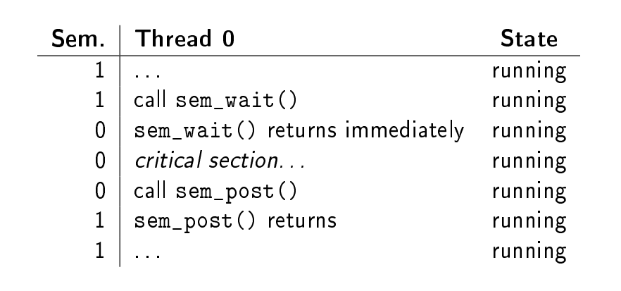
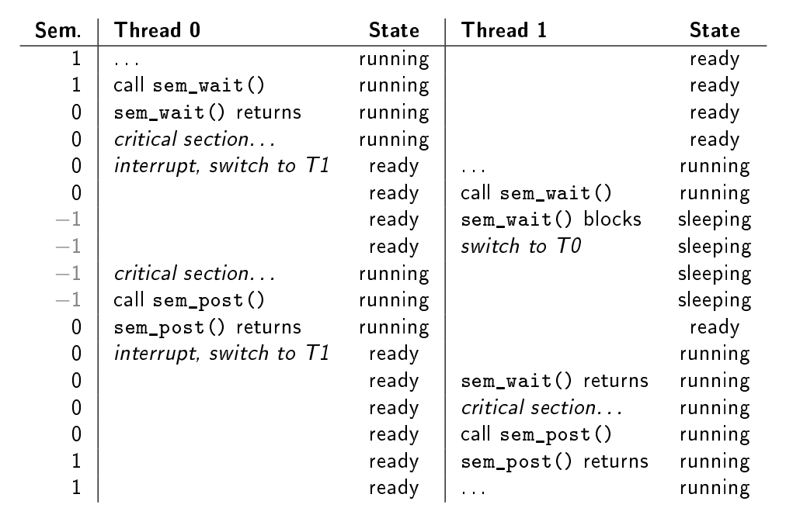
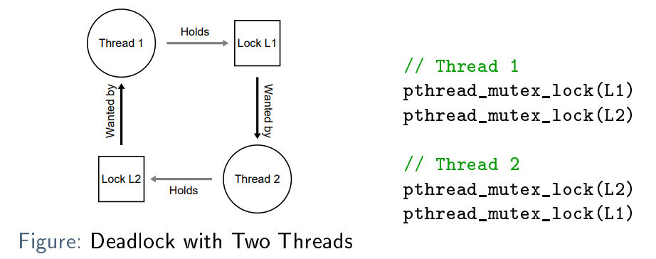

# Semaphores

Erweiterung von

- Locks und Mutexes
- Condition variables

Semaphoren können für beides verwendet werden. Semaphore ist ein Objekt mit einem Interger Wert, welcher typischerweise
mit zwei Atomic Funktionen manipuliert wird:

- Incrementing: `sem_post() or V()`
  Wakes up one thread if there is one or more waiting
- Decrementing: `sem_wait() or P()`
  Blocks the calling thread if the semaphore becomes negative

## Binary Semaphores

In our first application, a semaphore will be used as a lock/mutex. For this, its initial value is set to 1

```
sem_t sem;
sem_init(&sem, 0, 1); // <-- init: 1

sem_wait(&sem);
// critical section
sem_post(&sem);
```





## Semaphores Ordering/ Condition variables

The semaphore is then initialized to 0 and the next call to sem_wait() immediately blocks. Another thread can then
signal by calling sem_post(). There are two possible execution flows:

- The thread calling sem_wait() is run first
    - The semaphore is decremented to −1
    - The thread is blocked
- The thread calling sem_post() is run first
    - The semaphore is incremented to 1
    - The other thread can run immediately when calling sem_wait()

````c
sem_t sem;

void *child(void *arg) {
  printf("child\n");
  sem_post(&sem);
  return NULL;
}

int main(void) {
  sem_init(&sem, 0, 0); // <-- init: 0
  printf("parent: begin\n");
  pthread_t thread;
  pthread_create(&thread, NULL, child, NULL);
  sem_wait(&sem);
  printf("parent: end\n");
  return 0;
}
````

## Producer/Consumer Problem

```c
void *producer(void *arg) {
    int i = 0;
    while (1) {
        sem_wait(&empty);
        put(i++);
        sem_post(&full);
    }
}

void *consumer(void *arg) {
    while (1) {
        sem_wait(&full);
        int item = get();
        sem_post(&empty);
        printf("%d\n", item);
    }
}

sem_t empty, full;
int main(void) {
    // ...
    sem_init(&empty, 0, MAX);
    sem_init(&full, 0, 0);
    // ...
}

```

__ISSUE:__ Race Condition, die critical session im put() und get() müssen geschützt werden.

--> Mutex so nah wie möglich an den Blocks machen, sonst gibt es ein Deadlock! (Wenn der Mutex vor dem `sem_wait(&full)`
geholt wird und dann das sem_wait den thread schlafen lässt)

## When to Use Semaphores?

Semaphores seem to be a generalization of locks and condition variables. Should they be used in place of them?

- It is in general possible to replace locks and condition variables with semaphores
- However, replacing specific constructions with generalizations is not always the best thing to do
    - E.g. it has been shown that building correct condition variables using semaphores is difficult
- Consider semantics and expressiveness
    - Using a mutex is probably more expressive than a semaphore initialized to 1
    - For synchronizing access to limited quantities (e.g. forbounded buffers), semaphores provide natural semantics (
      i.e.they "count" the number of available items)

# Reader Writer Locks

Mit Semaphoren können wir ein read write lock implementieren. Man kann so sicher sein, dass nur jemand am Schreiben ist
und keiner am Lesen, oder wenn einer oder mehrere am Lesen sind niemand am Schreiben

````c
struct rwlock {
  sem_t lock; // mutex for writelock manipulation
  sem_t writelock; // mutex for writing access
  int readers; // current number of readers
};

void rwlock_init(struct rwlock *lck) {
  lck->readers = 0;
  sem_init(&lck->lock, 0, 1);
  sem_init(&lck->writelock, 0, 1);
}

void rwlock_acquire_readlock(struct rwlock *lck) {
  sem_wait(&lck->lock);
  lck->readers++;
  if (lck->readers == 1) // first reader acquires writelock
    sem_wait(&lck->writelock);
  sem_post(&lck->lock);
}

void rwlock_release_readlock(struct rwlock *lck) {
  sem_wait(&lck->lock);
  lck->readers--;
  if (lck->readers == 0) // last reader releases writelock
    sem_post(&lck->writelock);
  sem_post(&lck->lock);
}

void rwlock_acquire_writelock(struct rwlock *lck) {
  sem_wait(&lck->writelock); 
}

void rwlock_release_writelock(struct rwlock *lck) {
  sem_post(&lck->writelock); 
}

````

# Dining philosophers

Gibt Deadlock, weil alle mit links anfangen, die Gabel zu nehmen. Einfache Lösung: Für einen Philosophen die Reihenfolge
ändern

# Deadlock



In der Praxis ist es schwierig, Deadlocks zu verhindern:

- Code Size/Complexity
- encapsulation

Vier notwendige Bedingungen für Deadlocks identifiziert werden, die dazu beitragen, sie zu vermeiden:

- Mutual exclusion: Threads müssen die exklusive Kontrolle über eine Ressource haben
- Hold-and-wait: Threads halten Ressourcen fest, während sie auf zusätzliche Ressourcen warten
- No preemption: Ressourcen können nicht zwangsweise von Threads zurückgewonnen werden
- circular wait: Es gibt eine zirkuläre Kette von Threads, die Ressourcen halten und Anfordern

### Preventing Circular Wait

- Wenn möglich, sollten Sie eine totale Reihenfolge beim Locken einhalten und immer alle Locks in der gleichen
  Reihenfolge machen
- Andernfalls ist eine partielle Reihenfolge je nach Lock erforderlich, die Sie unbedingt dokumentieren müssen!
- Lock Ordering by Address: Je nach Memory Adresse die Reihenfolge der Locks

### Preventing Hold-and-Wait

Kann vermieden werden, indem alle Sperren auf einmal, atomar erworben werden

Nachteile/Issues:

- Negativer Einfluss auf die Concurrency
- Es muss klar sein, welche Locks benötigt werden

### Preemption

Es gibt kein Vorrecht auf Sperren, d.h. auf die Aufhebung einer Sperre für einen Thread. Eine mögliche Umgehung könnte
die Verwendung von ``pthread_mutex_trylock()``, die einen Fehler zurückgibt, anstatt blockiert, wenn eine Sperre bereits
gehalten wird.

Nachteile/Issues:

- Keine richtige preemption
- Ein __live-lock__ kann auftreten: mehrere Threads laufen, keiner schafft es, beide Sperren zu erreichen

# Atomicity Violations

Kann auftreten, wenn angenommen wird, dass ein Teil des Codes als Ganzes ausgeführt wird, während er in Wirklichkeit
vorzeitig beendet werden könnte:

````c
// Thread 0
...
if (fileptr) { // <-- assumed to be run together...
  ...
  fputs("data", fileptr); // <-- ...with this
  ...
}

// Thread 1
...
fclose(fileptr);
...

````

Können oft einfach gelöst werden, indem man richtig Lockt

# Order Violation Bugs

treten auf, wenn eine bestimmte Reihenfolge der Ausführung (zwischen Threads) angenommen wird:

Lösung: die Reihenfolge mit Hilfe von condition variables oder Semaphoren zu erzwingen
