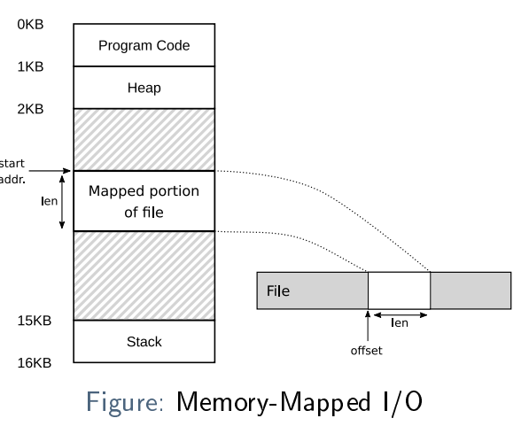
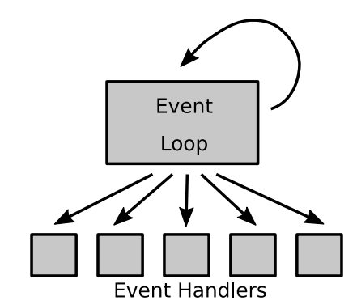

# Multi-Programming and IPC (inter-process communication)

Ganz generell kann es beim Multi-Programming dieselben Schwierigkeiten mit mutual exclusion und synchronisation geben.
Z.B. Shared Memory

## Memory-Mapped I/O

- Eine Option um mit Files zu arbeiten
- mit ``mmap()`` wird ein File in den virtual memory von einem Prozess gemappt
- Dann kann man ganz normal auf die Memory-Adresse zugreifen
  

## Shared Memory

todo

### Sharing Mutexes and Condition Variables

Wenn es Shared Memory gibt, dann können zwei Prozesse Mutexes und CV's austauschen

````c
struct shared_data {
  pthread_mutex_t mutex;
  pthread_cond_t cv;
  int i;
};
````

Damit dies funktioniert müssen die Mutexes und die CV als PTHREAD_PROCESS_SHARED initialisiert sein:

````c
pthread_mutexattr_t mutex_attr;
pthread_mutexattr_init(&mutex_attr);
pthread_mutexattr_setpshared(&mutex_attr, PTHREAD_PROCESS_SHARED);
pthread_mutex_init(mutex, &mutex_attr);
````

### Named Semaphores

Erlauben den gebrauch in shared memory, einfach einen Namen angeben:

````c
sem_t *sem = sem_open("/semaphore", O_CREAT, S_IRUSR | S_IWUSR, 0);
if (SEM_FAILED == sem) {
  perror("Failed to open semaphore!");
  exit(1);
}
// sem_wait(sem), sem_post(sem) ...
// sem_close(sem); or
sem_unlink("/semaphore");
````

# Event-Based Concurrency

- Eine weitere Möglichkeit zum Erstellen von __concurrent applications__
- mit einem "single thread of execution"
- Oft im GUI, Node.js
- Es kann die Probleme mit Deadlocks und mutex lösen, man ist nicht abhängig vom Scheduling, über welches man keine
  Kontrolle hat

## Idee: Event Loop

1. Endloser event loop
2. Warten bis events auftreten
3. Wenn ein Event eintritt, entsprechend verarbeiten (Event handler mit callbacks)

__Wenn ein Event Handler ein Event verarbeitet, ist dies die einzige Aktivität, die in diesem Moment stattfindet. Daher
ist die Wahl der Reihenfolge, in der zu behandeln, ist also eine Form des prozessinternen Scheduling!__



## Receiving Events

I/O Multiplexing: Anstatt auf Daten von einem File Descriptor zu warten, funktioniert es so:

- Eine Liste von Deskriptoren, an denen ein Prozess interessiert ist, wird an das Betriebssystem übergeben ``select()``
  oder ``poll()``
- Später und Periodenmässig, kann das Betriebssystem nach Änderungen in diesen Deskriptoren abgefragt werden
- Das OS gibt eine Liste mit den geänderten Descriptors zurück
- Der Prozess kann dann mit dem Lesen/Schreiben in den geänderten Deskriptoren usw. fortfahren.

## Synchronous and Asynchronous APIs

> synchronous API: ist BLOCKING, führt alle seine Arbeit aus, bevor er zum Caller zurückkehrt

> asynchronous API: ist NON-BLOCKING, kehrt sofort zum Caller zurück unf performt die Arbeit im Hintergrund

Event-Based Concurrency bringt auch Probleme mit sich:

- Blocking (synchronous) syscall: Jeder syscall der blockiert während er in einem Event handler gebraucht wird, blockt
  den gesamten Event loop
- Klassische I/O Apis sind in diesem Umfeld nicht erlaubt. Lange und intensive Berechnungen auf der CPU sind auch
  schlecht.
- State Management ist viel komplizierter

````c
// nicht Event based
int rc = read(fd1, buffer1, size1);
rc = write(fd2, buffer1, size1);
rc = read(fd3, buffer2, size2);
rc = write(fd4, buffer2, size2);

// event based
rc = read(fd1, buffer1, size1);
rc = read(fd3, buffer2, size2);
some_op();
...
rc = write(fd2, buffer1, size1);
some_other_op();
...
rc = write(fd4, buffer2, size2);
even_more_ops();
...
````

Weiter Probleme:

- Scalability: Heutzutage muss für effiziente Berechungen mehrere CPUs verwendet werden, dann kommen auch wieder di
  bekannten Concurrency Probleme
- Implicit blocking: Interaktion mit anderen Aktivitäten des Systems: Wenn ein event handler page faults, dann wird der
  gesamte Prozess implizit blockiert.
- Maintainability (Instandhaltbarkeit): Erhöht die Code-Komplexität

# Asynchronous I/O

In der Praxis wird es nicht oft gebraucht, da der Code generell Komplex ist, wegen dem State management

