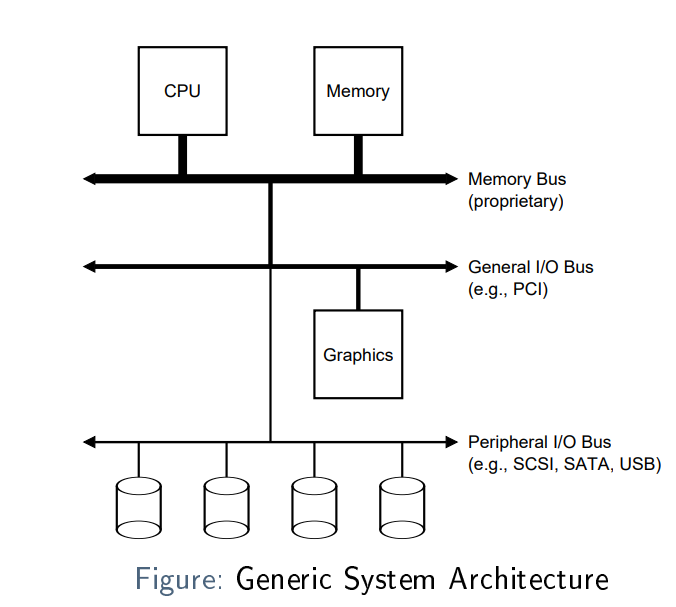
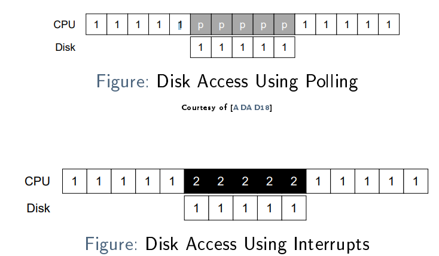
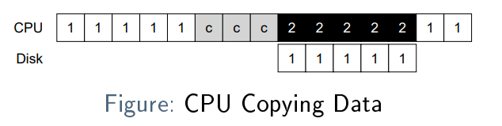
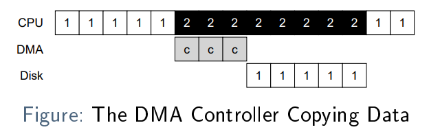
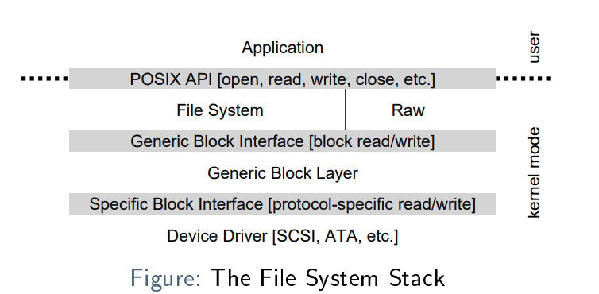
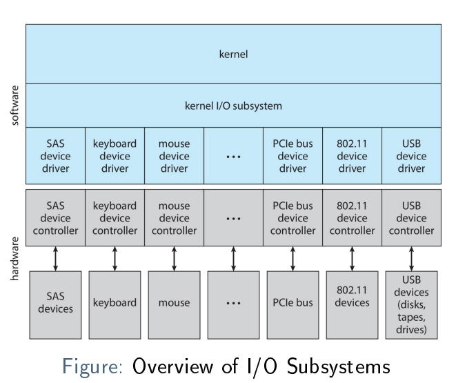
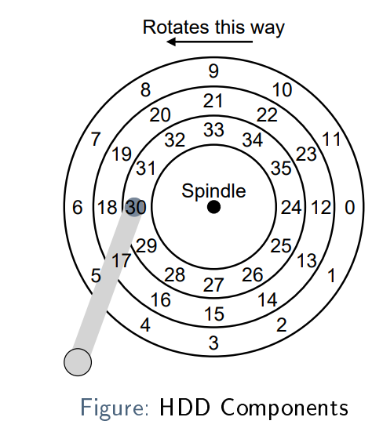
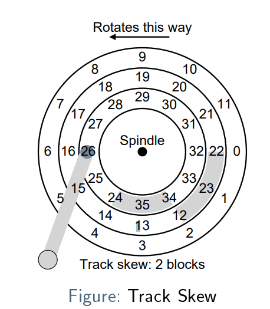
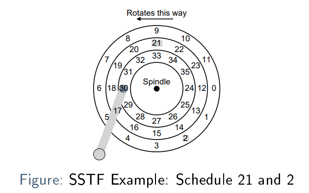

# Bus Hierarchies

I/O-Devices sind in der Regel an eine Art Bus angeschlossen

- memory bus
- general i/o bus
- Peripheral buses (SATA, SCSI, USB)

The need for such a hierarchy comes from physics: Faster signals require shorter wires.

## Typical I/O Device

To discuss I/O, gehen wir von einem typischen Gerät aus, das aus zwei relevanten Teilen besteht:

- Hardware interface
    - Elektrische und mechanische Spezifikationen
    - Ein definiertes Protokoll für die Interaktion
- Internal Structure
    - Hardware Implementation
    - Nicht relevant aus OS-Sicht

### Hardware interface

besteht aus einer Reihe von **Registern**, über die das Betriebssystem mit ihm interagieren kann:

__Status__: Kann ausgelesen werden, um sich über den aktuellen Status eines Geräts zu informieren. Typischerweise werden
verschiedene Flags (Bits) zur Statusanzeige verwendet.

__Command__: Kann geschrieben werden, um Befehle an das Gerät zu geben (Aktionen, die es als nächstes ausführen soll)

__Data__: Normalerweise werden Daten empfangen ode geschrieben. Für dies benötigt man auch ein Register

### Programmed I/O (PIO)

in Datenaustausch findet statt, indem Daten gelesen/geschrieben werden und dem Gerät mitgeteilt wird, was als nächstes
zu tun ist. Dies erfordert Arbeit von der CPU. Wir bezeichnen I/O, die eine Interaktion mit der CPU erfordern, als
programmierte I/O (PIO)

Ein solches Protokoll ist ineffizient und verschwendet CPU Zeit während:

- waten und abfragen, bis das Gerät ready ist. Mögliche Lösung: I/0 Interrupts
- transfer der Daten vom/zu dem Gerät. Mögliche Lösung: Direct Memory Access

### I/O Interrupts

Mit Interrupts kann das erste Problem gelöst werden:

- Command zum Gerät senden
- Den gecallten Prozess zum Schlafen bringen, switchen zu einem anderen
- Später, wenn das Gerät fertig ist, generiert es einen Interrupt
- Der OS interrupt handler wird getriggert und als Resultat kann an den Prozess zurückgegeben werden

Das ist nicht immer die beste Lösung:

- SSD ist schneller als Context-Switching, keine interrupts, polling ist besser
- Häufige Interrupts können zu Livelocks führen

Unterschied polling vs interrupts:

### Direct Memory Access

Anstelle von der CPU, kopiert ein DMA controller die Daten. Der DMA Controller macht ein interrupt, wenn er fertig ist

Ist im Memory, kopiert daten vom Memory auf den Speicher ohne die volllast der CPU zu brauchen.

## Device Interaction Methods

Wie wird auf die Hardware Interface register zugegriffen:

- Explicit I/O instructions: Es gibt explizite CPU Instructions, um mit den Hardware I/O register umzugehen.
  Typischerweise brauchen sie I/O Ports um ein Gerät zu adressieren
- Memory-mapped I/O: I/O-Register werden als "memory locations" zur Verfügung gestellt

# Drivers

Es gibt viele verschiedene I/O devices, darum braucht es Abstraktion. Heute machen sie oft den größten Teil des
Betriebssystem-Kernel-Codes aus.

## Layering

Es werden oft mehrere Abstraktionsschichten gebraucht:
Specific device interface → device driver → generic interface → API (e.g. POSIX) → user space.

## I/O Subsystem

Drivers werden generell in einem I/O Subsystem vom OS Kernel organisiert. Es enthält den Diver Code und stellt ein
gemeinsames Interface zur Verfügung

# Hard Disk Drives (HDD)

- besteht aus einer großen Anzahl von 512-Byte-Blöcken
- jeder block hat eine Adresse (Nummeriert von 0 bis n-1)
- Es wird garantiert, dass nur ein einziger Block atomar geschrieben
- besteht aus rotierenden disks (platters)
- Fixiert an einer Spindel, rotieren die Disks schnell (10'000 rotations/min, 6ms für eine Rotation)
- Konzentrische Tracks auf jeder Seite
- Disk Head an einem Arm bewegt sich über die Tracks

Eine Seite eines HDD platter, mit 3 Tracks und 35 blocks/sectors:

## Disk Latency

Bis man den richtigen Platz gefunden hat, muss man warten. Deshalb interrupt, weil HDDs sind langsam.

__Seek Time:__ Die Zeit, die benötigt wird, um den disk arm zu positionieren, z. B. um auf Block 6 zuzugreifen, der zwei
tracks entfernt ist.

__Rotational Delay:__ Die Zeit, die vergeht, bis der gewünschte Block unter dem disk arm durchgedreht ist. Z.B. der
Zugriff auf Block 24 die Hälfte der Zeit einer einzigen disk rotation.

__Transfer Time:__ Zeit die benötigt wird, um den gegeben Block zu schreiben oder lesen

We define I/O time , TI/O as follows:

> TI/O = Tseek + Trotation + Ttransfer

Furthermore, the I/O rate, RI/O

- gibt die Menge der pro Zeiteinheit (in der Regel Sekunden) übertragenen Daten an

> RI/O = (Sizetransfer) / (TI/O)

Sizetransfer ist die Menge der übertragenen Daten.

### Example

| | Cheetah 15K.5 | Barracuda |
| ---- | ---- | ---- |
| Capacity | 300 GB | 1 TB |
| RPM | 15'000 | 7'200 |
| Average Seek | 4 ms | 9 ms |
| Max Transfer | 125 MB/s | 105 MB/s |
| Platters | 4 | 4 |
| Cache | 16 MB | 16/32 MB |
| Interface | SCSI | SATA |

zufälligen workload für den Cheetah 15K.5 mit 4KiB Lesungen an zufälligen Orten:

> Tseek = 4ms

(2ms weil angenommen wird, dass man durchschnittlich eine Halbe runde entfernt ist)
> 15000 RPM = 250 RPS = 1/250 sec  pro Rotation = 4ms pro Rotation
>
> Trotation = 4ms/2 = 2ms

> Ttransfer = 4096 bytes / 125MB/s = 33us

> TI/O = 6ms und RI/O = 0.68 MB/s (4096 bytes / 6 ms)

Sequential Workload: Seek und Rotation fallen weg, RI/O entspricht dann quasi dem Max. Transfer

## Caching

Moderne HDDs haben alle einen Local Cache, welcher Daten die gelesen oder geschrieben hält. Dies bietet dem
On-Disk-Controller Chip eine größere Flexibilität, zum Beispiel:

- Um mehr als die angeforderten Daten zu lesen (z. B. einen ganzen Track anstelle eines einzelner Block)
- Um das Schreiben auf Blöcke zu optimieren, die sich auf verschiedenen Spuren befinden

Beim Schreiben gibt es zwei Optionen:

- Write back caching (also immediate reporting): Ein Schreibvorgang wird quittiert, sobald sich die Daten im Cache
  befinden. Das mag schneller erscheinen, kann aber gefährlich sein, wenn eine bestimmte Schreibreihenfolge vom
  Betriebssystem verlangt wird
- Write through caching: Erst quittieren, wenn die Daten auf die Festplatte geschrieben wurden.

## Track Skew

Stellt sicher, dass es nicht unnötige Rotationen gibt, wenn auf sequentielle Daten über mehrere Tracks zugegriffen wird

## Disk Scheduling

Weil I/O teuer ist, gibt es Optimierungspotenzial. Ein OS hat typischerweise eine Art von Disk Scheduling

Anders als beim job Scheduling kann bei hier die Dauer eines Jobs berechnet werden. Und so ist das Gebrauchen von SJF
(Shortest job first) möglich

Moderne HDDs geben die internals nicht ans OS weiter. Das OS kann also nicht so viel tun. Normalerweise wird eine kleine
Menge von disk requests vom OS geplant, wobei versucht wird, den besten Fall zu erraten; die endgültige Planung erfolgt
dann auf der Festplatte.

### Shortest Seek Time First (SSTF)

- Die Requests nach Track ordnen
- Wählt die Requests aus dem nächsten Track als erstes

Issues:

- OS kennt Disk-Geometrie nicht, es sieht nur ein Array mit Blocks; Lösung: → Nearest Block First (NBF)
- neigt zum **starvation**:
    - Blocks 21 (middle track) and 2 (outer track) are scheduled
    - A (long) stream of requests for blocks on the inner track (24-30) occurs
    - During those requests, blocks 21 and 2 will not be served!

### Elevator Algorithms

- Um starvation zu verhindern
- Scannen/Swipen vom einen Ende zum anderen
- ``SCAN``: Bewegen Sie sich zu einer Seite der Scheibe, ändern Sie dann die Richtung und bewegen Sie sich auf die
  andere Seite.
- ``F-SCAN``: Wie SCAN, aber Einfrieren der Queue von Requests während eines Sweep. Dies verhindert das Aushungern von
  weit entfernten Anfragen.
- ``C-SCAN``: Sweep nur in eine Richtung (z. B. von aussen nach innen). Dies sorgt für gleichmässigere Wartezeiten

### Shortest Positioning First (SPTF)

Weder die Elevator Algos noch SSTF sind SJF (shortest job first) Algos, da sie die Rotationsverzögerung nicht
berücksichtigen

Wenn man davon ausgeht, dass Seek- und Rotationszeiten ungefähr gleich lang sind, könnte es sinnvoll sein, Blöcke auf
weiter entfernten Spuren zuerst zu bedienen.

shortest positioning time first (SPTF), a.k.a. shortest access time first (SATF) machen dies

Die benötigt aber detailliertes Wissen über den driver state (aktuelle Pos des disk head) und kann so nur auf dem Disk
controller implementiert werden

