# RAID (Redundant Array of Independent Disks)

RAID System kann eine der folgenden Punkte verbessern:

- Performance
- Capacity
- Reliability (Zuverlässigkeit)

Ein RAID System ist eine Kombination von mind. 2HHDs welche wie eine einzelne HDD zugegriffen werden

- Hardware RAID:
    - RAID Controller
    - Moderne Mainboards offerieren meist RAID Funktionalität
- Software RAID:
    - HDDs direkt vom PC zugreifen
    - implementiert im OS als Device driver

## RAID 0 - Striping

We use N for the number of disks and B for the number of blocks

- Kein wirkliches RAID Level, die Redundanz fehlt
- Optimal für Performance und Kapazität
    - N*B Blocks total, N gleichzeitig zugreifen

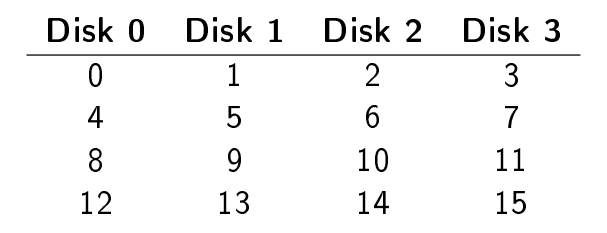

### Chunk Size

Das Bsp. hat Chunk Size = 1, 1 Block pro Chunk

2 Blöcke pro Chunk

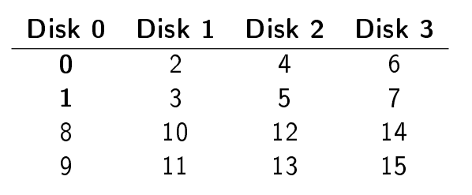

Chunk Size hat Einfluss auf die Performance

- Kleine Chunks → viele Files werden über die Festplatten verteilt
    - Mehr read & write parallel
    - Die Positionierungszeit erhöht sich
- Grosse Chunks reduzieren Parallelism pro File, aber auch die Positionierungszeit

⇒ Optimale Grösse ist abhängig vom Workload

## RAID 1 - Mirroring

- Idee: Speichere eine Kopie von jedem Blok auf jeder Disk
- Redundanz von N-1 Disks
- Performance: Kommt auf Impl. darauf an, 1 - N fürs Lesen, schreiben generell 1

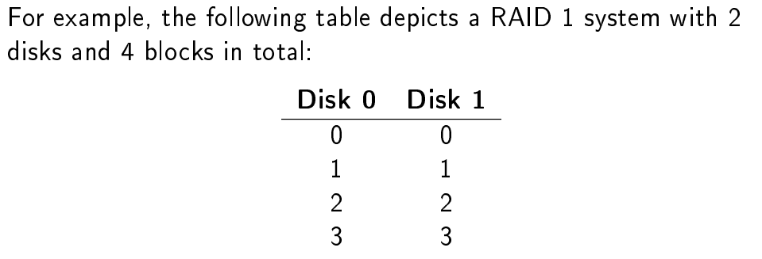

## RAID 10 and RAID 01

Idee RAID 0 & 1 kombinieren

### RAID 10

Kombiniert zwei oder mehr Mirror-Paare in ein Raid 0

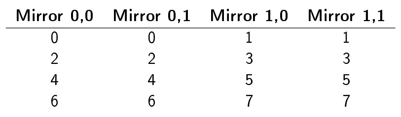

- Kapazität: N/M (M = Anz. Mirror-Paare)
- Redundanz: Mind. 1 und kann bis zu (N/2) gehen
- Performance: Wie RAID 0

### RAID 01

Gespiegelte Striped Pairs:

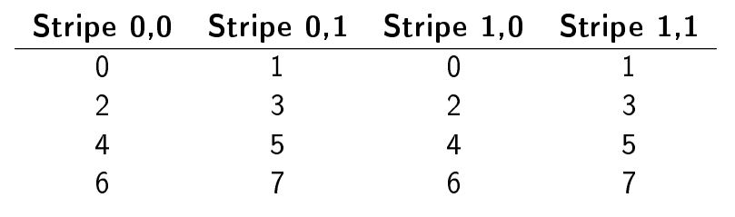

Keine Gute idee: Ein einziger Fehler auf einer einzigen Disk, wird dazuführen, dass der gesamte Stripe verloren geht

## RAID Level 4 - Parity

- Eine zusätzliche Disk speicher parity information
- Braucht Parity Information um reliability herzustellen
- Verbessert die overall Kapazität

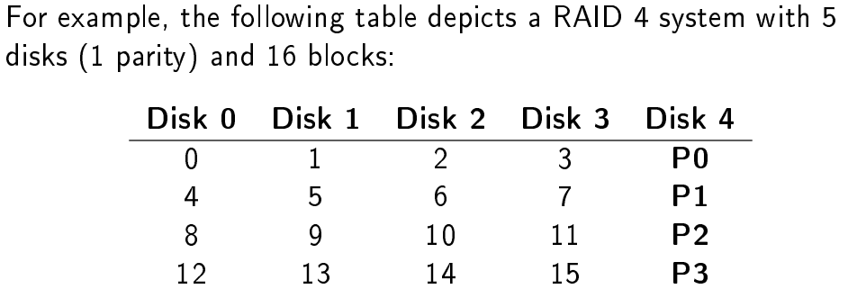

### Impl. Parity

- Mit XOR
- Given 4 bits {0, 0, 1, 1}, the parity is 0 ⊕ 0 ⊕ 1 ⊕ 1 = 0
- Wenn ein Bit verloren gegangen ist, kann man es mit dem Parity Bit wiederherstellen

#### Additive and Subtractive Parity

- Full-stripe writes bei grossen, sequenziellen Chunks
- bei einem Random Write muss nur der single Block und die Parität aktualisiert werden

Zum Berechnen gibt es 2 Möglichkeiten:

- Additive parity: Jeden Block auslesen und parity berechnen, Problem: Bei vielen Disks, viele Berechnungen
- subtractive parity:
    - P<sub>new</sub> = B<sub>old</sub> ⊕ B<sub>new</sub> ⊕ P<sub>old</sub>
    - Alter Wert = {0, 0, 1, 1, 0}
    - Neuer Wert = {1, 0, 1, 1, X}
    - Berechnung: 0 ⊕ 1 ⊕ 0 = 1, thus {1, 0, 1, 1, 1}

### The Small-Write Problem

Die Parity Disk kann zu einem Flaschenhals werden, wenn z.B. zwei kleine Änderungen gibt und beide auf der Parity Disk
schreiben müssen. Die Werte selbst können Parallel geschrieben werden

## RAID Level 5 - Rotating Parity

- Verteilen der Paritätsdaten auf alle Festplatten des RAIDs
- behebt das "Small-Write-Problem" durch die Verteilung von Paritätsinformationen.

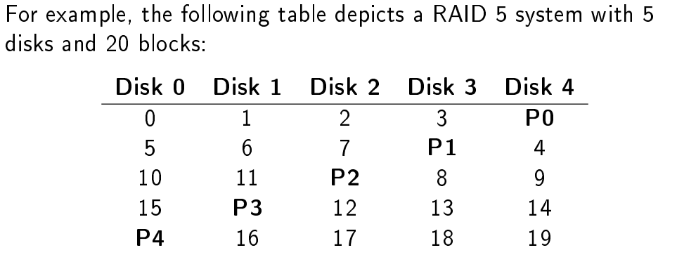

## RAID Level 6 - Double Parity

- Redundante Paritätsinformationen haben (XOR Funktioniert jedoch nicht mehr)
- Adressiert folgende Probleme: Wiederherstellungszeit und Ausfallwahrscheinlichkeit: Aufgrund der heutzutage großen HDD
  Kapazitäten kann ein Rebuild mehrere Stunden oder sogar Tage dauern. Die Chancen, dass in dieser Zeit eine zweite
  Festplatte ausfällt, ist mittlerweile relevant.

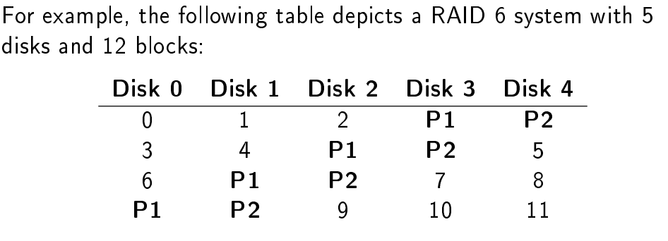

# Files and Directories

> Ein File ist ein lineares Array von Bytes. Es kann gelesen und geschrieben werden.
> Ein File har einen low-level name welcher mit der inode Nummer referenziert wird

> Ein Directory ist ein spezieller Typ von einem File. Hat auch eine Inode Nummer
> Aber speziellen Content: Eine liste von (indo, name)-Paare

## File API

````c
// open or create a file, returns a file descriptor
int open(const char *pathname, int flags);

// read and write to a file descriptor
ssize_t read(int fd, void *buf, size_t count);
ssize_t write(int fd, const void *buf, size_t count);

// close a file descriptor
int close(int fd);
````

## File Descriptor

Ist einfach eine ganze Zahl, die als Handle für eine offene Datei verwendet wird. Jeder Prozess hat seinen eigenen Set
offener File descriptors, und ihre Nummerierung beginnt immer bei 0. Zu Beginn hat ein Prozess die folgenden offenen
Dateideskriptoren:

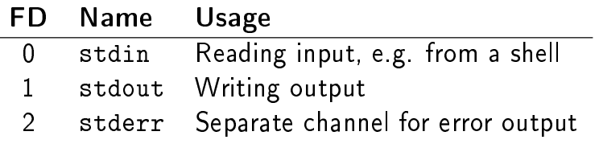

- Jeder Prozess muss sine offenen FD's tracken
- Es gibt ein open file table
- Jedes File hat ein **file offset**
    - Read und Write passen den offset implizit an
    - Explizit kann der Offset mit ``lseek()``  angepasst werden

### Examples

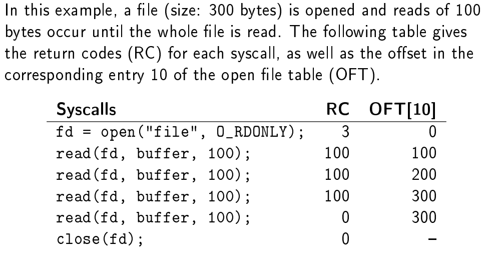

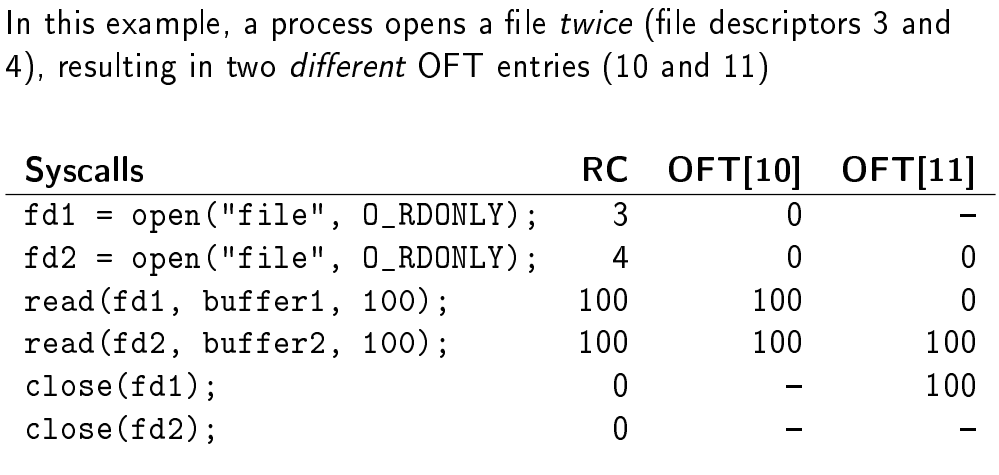

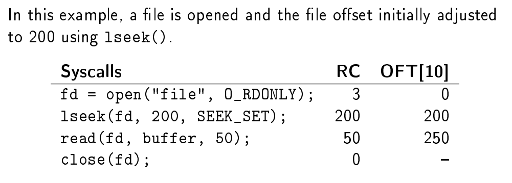

### Shared File Table Entries

Ein Eintrag der Open File Tabelle kann zwischen Prozessen oder verschiedenen FD's geteilt werden

- Offene FD's werden zwischen Parent und Child geteilt nach einem ``fork()``
- FD's können dupliziert werden um Output redirection zu implementieren
- Mit ``sendmsg()`` kann ein FD zu anderen Prozessen geschickt werden
- Wenn ein Eintrag in der Dateitabelle gemeinsam genutzt wird, wird die Anzahl der Verweise erhöht, und er wird erst
  entfernt, wenn er wieder 0 erreicht.

### Other Important File Syscalls

````c
// force writing a file to disk
// (may be buffered by the file system!)
int fsync(int fd);

// rename a file
int rename(const char *oldpath, const char *newpath);

// retrieve file metadata
int stat(const char *pathname, struct stat *statbuf);
int fstat(int fd, struct stat *statbuf);

// delete a file
int unlink(const char *pathname);
````

## Directory API

````c
// create a directory
int mkdir(const char *pathname, mode_t mode);

// open a directory
DIR *opendir(const char *name);

// read directory contents
struct dirent *readdir(DIR *dirp);

// close a directory
int closedir(DIR *dirp);

// remove a directory (must be empty!)
int rmdir(const char *path);
````

## Hard Links

2 Dinge geschehen, wenn ein File erstellt wird:

1. Ein neuer inode wird erstellt, der alle relevanten Informationen und die Daten der neuen Datei enthält
2. An für den Mensch lesbarer Name wird mit dem inode verlinkt, im entsprechenden Directory

Wird ein Hard Link verwendet, dann wird ein zusätzlicher Name mit dem inode verlinkt. Files haben ein reference Count,
welches die Anz. von Hardlinks beinhaltet, wenn es 0 erreicht, kann ein File auch effektiv gelöscht werden

Funktionieren nicht für: 

- Directories
- Files auf einem anderen File System

## Symbolic Links

Ein andere File Type (besides regular files and directories) welche eine Art Pointer zu einem anderen File beinhalten

Valid paths: /a_dir, /a_file, /a_dir/hardlink, /a_dir/foo, /a_dir/bar.
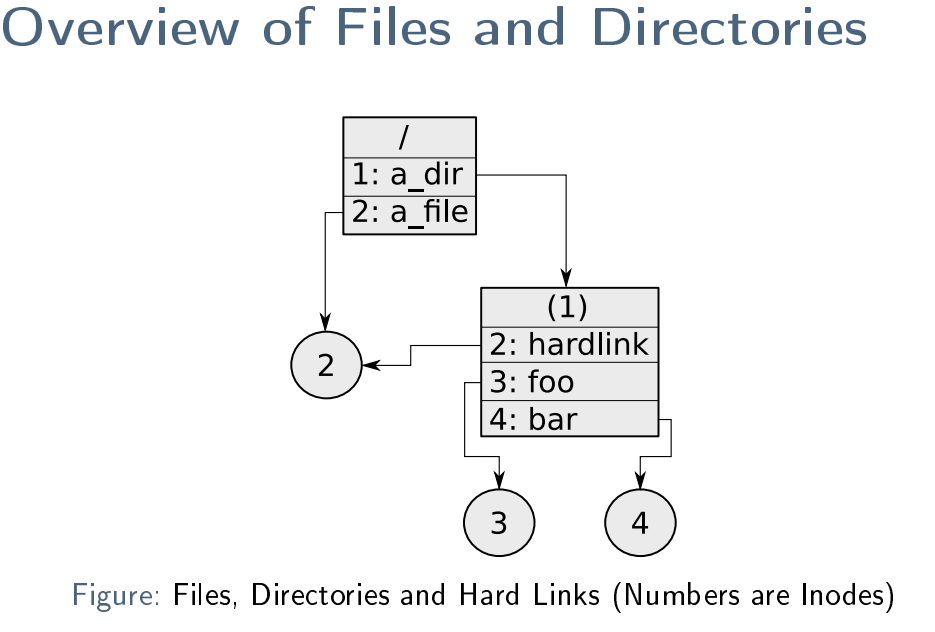

## Access Control

- Weil Files geteilt werden, brauchen sie einen access control Mechanismus
- UNIX: Permission Bits
  - Permissions für r: read, w: write, x: execute
  - Angewendet für u: user (owner), g: group, o: all others

### Example

````text
To change user and group, chown and chgrp may be used:

$ ls -l file1
-rw-r--r-- 3 root root 15 May 1 22:01 file1
$ chown test file1
$ chgrp test file1
$ ls -l file1
-rw-r--r-- 3 test test 15 May 1 22:01 file1
````

````text
To change permissions, chmod is used:

$ ls -l file1
-rw-r--r-- 3 test test 15 May 1 22:01 file1
$ chmod u=rwx,g+wx,o-r,o+x file1
$ ls -l file1
-rwxrwx--x 3 test test 15 May 1 22:01 file1
````

````text
Permissions can also be given as octal number
(r=4, w=2 and x=1):

$ chmod 644 file1
$ ls -l file1
-rw-r--r-- 3 test test 15 May 1 22:01 file1
$ chmod 771 file1
$ ls -l file1
-rwxrwx--x 3 test test 15 May 1 22:01 file1
````
