# File Systems

- Der Teil des Kernels welcher zuständig ist für die Interaktionen zwischen den Geräten und der File-API
- Pure Software, braucht keine HW-Features

## File Systems Structures

### Blocks and Extents

- Im Allgemeinen unterteilt ein FS eine Festplatte in diskrete Einheiten, entweder Blöcke oder Extents.
    - Ein Block ist wiederum eine Einheit mit fester Grösse
    - Ein Extent ist ein zusammenhängender Bereich, der für eine Datei reserviert ist.


### Data Region and Inode Table

Die verfügbaren Blöcke werden in zwei Teile geteilt, abhängig von der Art der Daten welche darin gespeichert ist:

- Data Region: Effektiven Daten
- Inode table: Inodes für die gespeicherten Daten
- Für jeden Teil wird eine fixe Grösse alloziert, wenn das FS kreiert wird

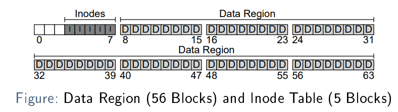

> Inode:

- allgemeiner Begriff für die Datenstruktur die Metadaten einer bestimmten Datei enthält.
- enthält typischerweise Dinge wie die File-Größe, zugehörige Datenblöcke, owner, permissions, Erstellungs-, Zugriffs-
  und Modifikationszeiten etc.
- Sind Typischer klein. (128 or 256 bytes)

````c
struct dinode {
  short type; // File type
  short major; // Major device number (T_DEV only)
  short minor; // Minor device number (T_DEV only)
  short nlink; // Number of links to inode in file system
  uint size; // Size of file (bytes)
  uint addrs[NDIRECT+1]; // Data block addresses
};
````

## Allocation Structures

FS muss wissen, welche Blocks noch frei sind. Für diese allocation Struktur braucht es eine Free List oder ein Bitmap

In Bsp. braucht es ein Bitmap für den Inode und den Data Block

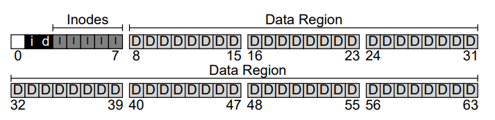

## Superblock

> Jedes Dateisystem speichert zusätzliche Metadaten über eine bestimmte FS-Instanz in dem
> entsprechenden Superblock. Er enthält typischerweise eine magische Zahl (die den FS-Typ identifiziert),
> die Anzahl der Inode- und Datenblöcke sowie andere wichtige Parameter

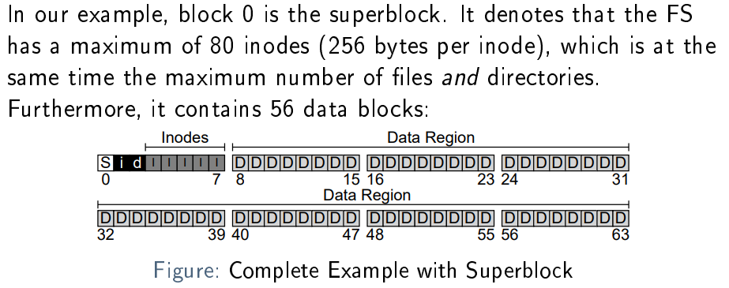

## Addressing Data Blocks

Wie können die Daten adressiert werden, wenn man den Inode hat:

- List of pointers zu den Data Blocks
    - Effizient und Flexibel
    - Limitiert die Filegrösse auf die Anzahl von Pointers mal der Blockgröße
- A linked list bestehend aus den Daten Blocks
    - Simpel
    - Random Zugriff auf einen Block in einem grossen File ist ineffizient

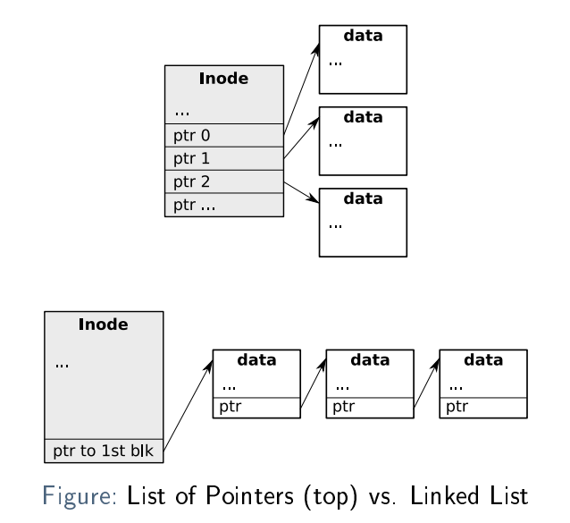

Eine andere Möglichkeit ist die Verwendung von Extents, anstatt einzelne Blöcke zu adressieren. Extents werden mit einem
Zeiger auf den Anfang und einer Länge in Blöcken adressiert. Sie sind weniger flexibel, aber kompakter.

### Multi-Level Index

- Ein Pointer der auf einen Block von weiteren Pointern zeigt
- Mit jedem Indirektionslevel können viel grössere Files erlaubt werden

# Access Methods

## Reading a File

We will assume reading the file ``/foo/ba`` (size: 3 blocks). The following steps must be performed by the FS:

1. The inode of ``bar`` needs to be found by directory traversal:
    1. Locate the inode of ``/`` (known to the FS, often 2)
    2. It is a directory, read its data blocks
    3. Locate the inode of ``foo``. If it is also a directory, go back to 1.2
2. Read the inode of ``bar``, check permissions, . . . , allocate and return a file descriptor
3. Read the 3 data blocks:
    1. Read the inode to find the address of the block
    2. Read the data block
    3. Update the inode of ``bar`` (e.g. last-accessed time)

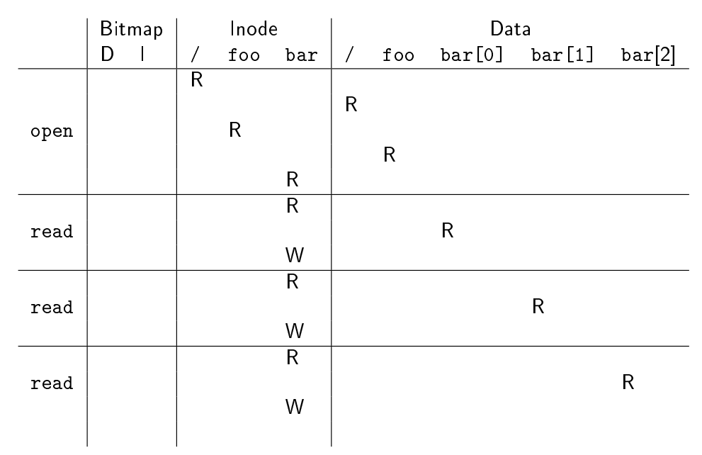

## Create a File "/foo/bar"

1. First, the file needs to be created
    1. The inode of ``foo`` needs to be found (requiring a directory traversal)
    2. A new inode needs to be allocated for ``bar``, requiring a read and a write of the inode bitmap
    3. The new inode of ``bar`` needs to be written
    4. The data of ``foo`` needs to be updated with name and inode number of ``bar``
    5. The inode of ``foo`` needs to be updated (e.g. last-accessed time)
2. The 3 data blocks can now be written (5 I/O requests each):
    1. A free block must be found, requiring a read and write of the data bitmap
    2. A read and a write are required to update the inode of ``bar``
    3. Finally, the data block is written

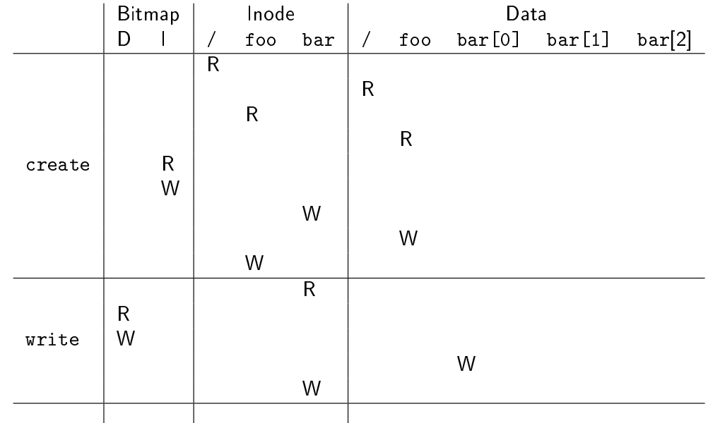

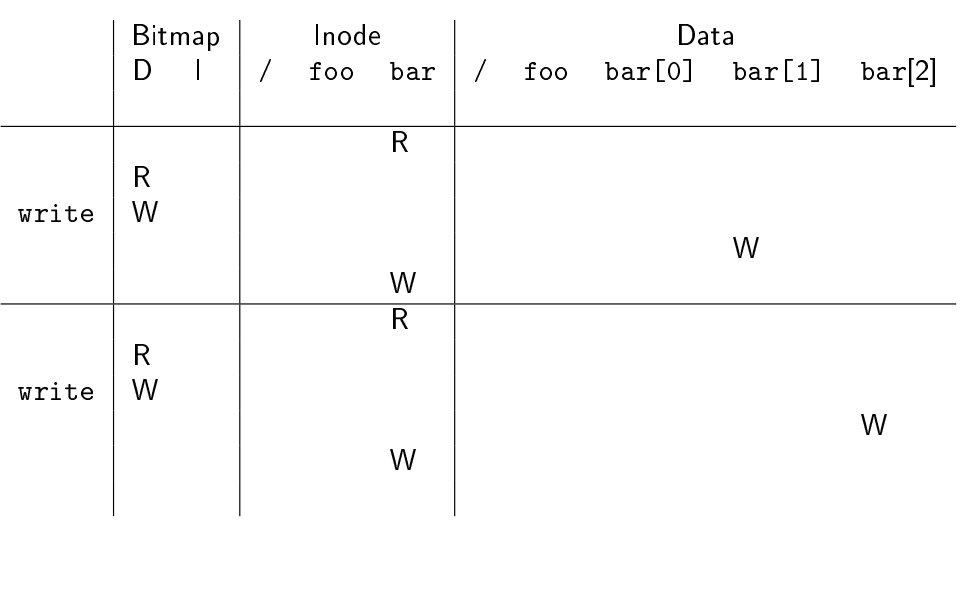

### Beobachtungen

- Auf die Bitmaps (allocation Structure) wird beim Lesen nicht zugegriffen. Beim Schreiben wird nur bei der Erstellung
  von Datenblöcken auf sie zugegriffen.
- Ein File zu erstellen braucht zusätzliche I/O Requests, weil auch das Directory updaten muss. Das wird schlecht, wenn
  das Directory einen neuen Block braucht
- File schleissen generiert keine I/O requests, nur die relevanten In-Memory-Strukturen müssen freigegeben werden.
- Je länger der Pathname, je grösser das directory traversal

## Caching and Buffering

- Im Allgemeinen verwenden Dateisysteme Caching für häufig verwendete Blöcke.
- Fürs Schreiben wird Caching auch Buffering genannt.

# Fast File System

Das UNIX FS aus den bisherigen Bsps hat seriöse performance Probleme

- Es gibt viele random-accesses, die Inodes sind weit weg von den Daten Blöcken
- Ein gebrauch einer Free-list führt mit der Zeit zu grösserer Fragmentierung
  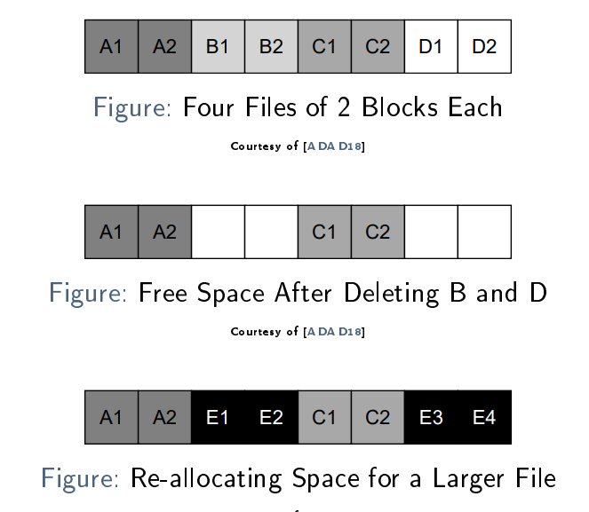
- Aufgrund der geringen Blockgröße (512 Byte) ist bei der Übertragung eine Menge Overhead bei der Übertragung entstanden

Das Fast File System geht die Probleme wei folgt an:

1. Mehr "Disk aware" sein, die FS Strukturen auf der Disk organisieren, was die access und read/write performance
   verbessert
2. Durch die Verwendung von Richtlinien, die versuchen, verwandte Dinge zusammenzuhalten
    1. Inodes und die dazugehörigen Data Blocks
    2. Directories und die Files welche diese beinhalten

## Grouping Blocks together

- Um den random access zu minimieren: Disk in block groups segmentieren
- Jeder Block group hat seine eigene FS Struktur
    - Eine Kopie des FS Superblocks
    - Per-group allocation structures
    - Inode Table und Data region

## Allocation Policies

- Neue Directories werden ine einer block group kreiert
    - mit einer kleinen Anzahl an allozierten Directories
    - Somit einer hohen Anzahl an freien Inodes
    - Die Directories werden ausgeglichen auf der Disk verteilt
    - stellt genügend Inodes für nachfolgende File-Allocations sicher.
- New Files werden im gleichen Block platziert wie deren Directory
    - Auch Datenblöcke die zum File gehören sind in dieser Gruppe plaziert
- Wenn nicht mehr genügend Platz ist, dann wird die nächste, angrenzende Gruppe verwendet

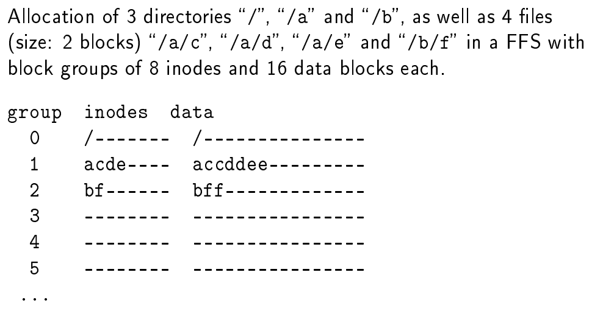

## Large-File Exception

Die FFS macht eine Ausnahme für grosse Dateien. Würde man sie gleich behandeln, würde eine große Datei eine oder mehrere
Blockgruppen füllen:


Um andere Dateien in derselben Gruppe zu ermöglichen, verteilt das FFS grosse Dateien auf mehrere Blockgruppen in
chunks bestimmter Größe:

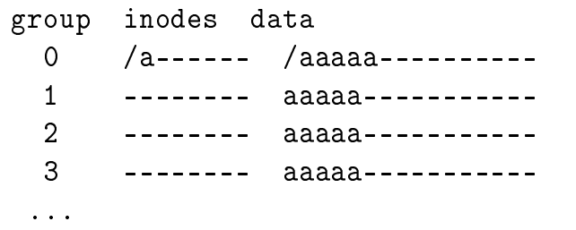

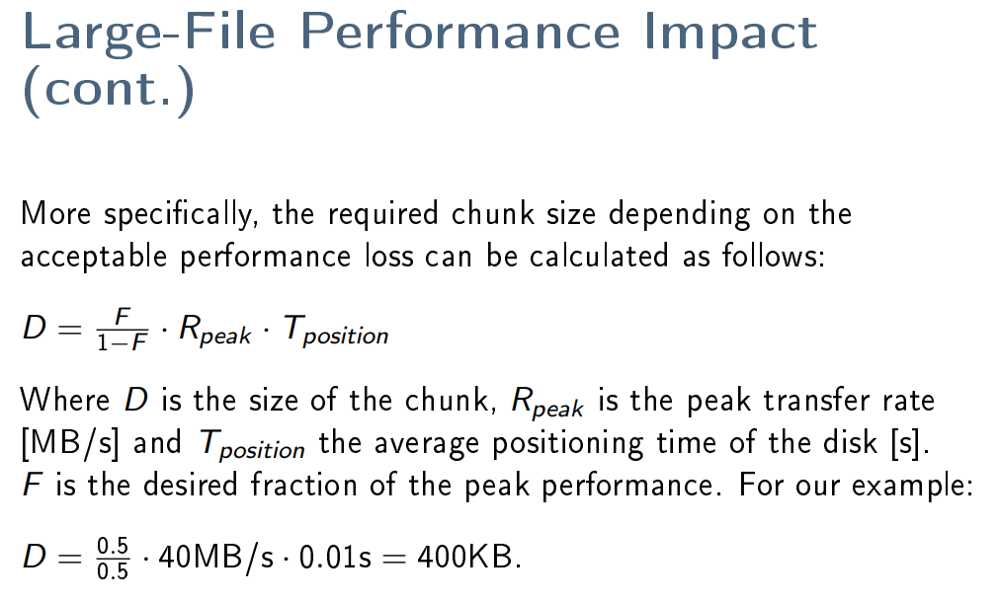


## Locality Assumptions

Dateien, die im Verzeichnisbaum nahe beieinander liegen, werden häufig gemeinsam aufgerufen, darum machen die Regeln oben einen Sinn
