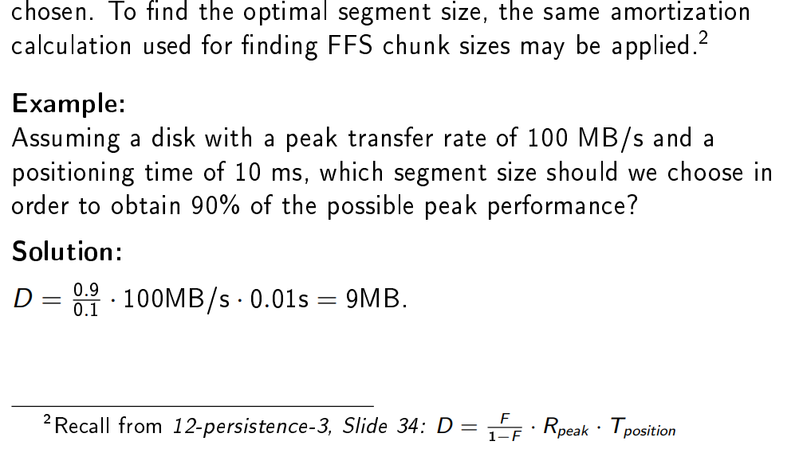
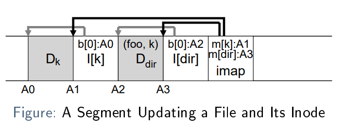

# Crash Consistency

- Basic Problem: Konsistenz von Vorgängen, die mehr als einen Schreibvorgang auf der Festplatte erfordern
- FS muss Daten über eine lange Zeit speichern
- Crash Consistency ist somit wichtig


## Fehlerszenarien

| Geschriebene Blocks | Resultat |
| ------------------- | -------- |
| Keine | Fehler vor dem Schreiben, Datenverlust, aber nicht Problem vom FS|
| nur Data| Datenverlust aber kein FS Problem, FS ist noch Konsistent|
| nur inode| Datenverlust, indoe points zu einem Garbage Block, FS ist Inkonsistent! (no allocation in bitmap) |
| Nur Bitmap| Datenverlust. FS ist inkonsistent, space leak, weil ein allocated block nie genutzt/freed wird
| Data & inode | Kein Datenverlust, aber FS inkonsistent. (no allocation in bitmap)|
| Data & Bitmap | Datenverlust und FS inkonsistent|
| Inode & Bitmap | Datenverlust. FS konsistent, aber pointet auf garbage block|

> Data Loss

Daten einfach verloren und es kann nichts unternommen werden. Benötigt Aktionen, wenn FS gleichzeitig inkonsistent wird

> FS inkonsistent

Es gibt einen Widerspruch in FS Strukturen, z.B. zwischen Inodes und Allokationsstrukturen. Muss aufgelöst werden.

> Space leaks

Eine spezielle Inkonsistenz, die die Kapazität des Dateisystems verringert. Sie muss ebenfalls behoben werden.

## File System Checker

- Ein Programm, das normalerweise läuft, wenn das FS nicht mounted wird (z.B. während dem Boot)
- Versucht FS Konsistenz wiederherzustellen
    - Verschiedene checks
    - fixing von gefundenen Problemen
- Sanity checks of the superblock
- Sanity checks of inodes (e.g. file type, number of links)
- Restore allocation structures based on the inode contents
- Checks of directory content

Ist nicht praktisch, denn bei zunehmender grösse immer langsamer! Checks sind zu teuer, wenn nur ein wenig bad blocks
erkennt werden können

# Journaling

- Variante von "write ahead logging"
- Idee: bevor die effektiven Updates performt werden, wird ein log geschrieben, was gemacht werden soll
- Wenn etwas schiefläuft können dann mit dem Log die Updates wiederholt werden
- Trade-Off: Normale writes benötigen mehr Zeit, aber die Wiederherstellung nach einem Absturz ist viel schneller.

Die Journaling fügt nun eine zusätzliche FS-Struktur hinzu, nämlich das Journal. Im Allgemeinen wird es irgendwo auf der
Festplatte platziert; andere Optionen, wie z. B. eine separate Journalplatte, sind ebenfalls möglich:


## Journaled Writing

1. Änderungen (Daten und Metadaten) in das Journal schreiben
2. Checkpoint des FS, d. h. Schreiben der Änderungen auf die Festplatte

jede Transaktion durch einige markers (TxB und TxE) abgegrenzt, die zusätzliche Metadaten über die Transaktion
enthalten.


## Recovery

1. The crash occurs before journal commit: Es gibt keinen State, welcher Safe wiederhergestellt werden kann: Daten sind
   verloren, die Transaktion wird gelöscht und das FS ist noch konsistent
2. The crash occurs any time while checkpointing: Das FS kann einfach die Transaktion vom Journal wiederholen: Redo
   logging

## Managing the Journal

- ist eine Zirkuläre Datenstruktur
- Nachdem eine Transaktion mit einem Checkpoint versehen wurde, muss sie im Journal wieder freigegeben werden

1. Journal Write
2. Journal Commit
3. Checkpoint
4. Free the checkpointed Transaction

## Metadata

Das Journaling sorgt für eine schnelle Wiederherstellung, aber jeder Schreibvorgang erfolgt nun zweimal! Dies ist
besonders schlecht für die sequentielle write performance.

- nur Metadaten, d. h. den Inode und die Inode-Bitmap, in das Journal schreibt. Die Datenblöcke werden direkt und nur
  einmal geschrieben.
- Wichtig: Die Reihenfolge, Es muss sichergestellt werden, dass die Data block vor dem Committen des Journals
  geschrieben werden

Data Journaling:


Metadata Journaling:


# Log-Structured File Systems (LFS)

Verhindern, dass Daten zweimal geschrieben werden

Idee:

- Alle writes Sequentiell performen
- Writes sollten entweder zusammenhängend oder gross sein, um Verzögerungen bei der Rotation zu verringern.
- LFS speichert Schreibvorgänge im Memory als Segment und schreibt dann das gesamte Segment auf die Festplatte, wenn es
  voll ist.

Bsp: Segment, welches 2 Inodes updated:


## Segment Size



## Inode Map (IMap)

- Ein Segment kann überall geschrieben werden
- beinhaltet ein update von random Inodes
- Inodes haben keine Fixe Platzierung mehr
- Um die Inodes zu finden, gibt es die IMap
    - Liste mit Inode Nummern mit Pointern zu der aktuellen on-disk location
    - As it needs to be updated frequently, it is split in chunks which are written as part of the segment in which the
      updates occur:


- Da sie als Teil verschiedener Segmente geschrieben wurden, ist schließlich ein Mechanismus zum Auffinden der
  verschiedenen IMap-Chunks erforderlich
- Dies wird durch die Checkpoint-Region erreicht, die einen Zeiger auf jeden aktuellen Chunk der IMap enthält:


Die Checkpoint-Region muss sich natürlich an einem bekannten Ort auf der Festplatte befinden. Sie wird im Speicher
zwischengespeichert und nur in regelmäßigen Abständen aktualisiert (z. B. alle 30 Sekunden) aktualisiert, um negative
Auswirkungen auf die Leistung zu vermeiden.

## Directories

Mit LFS nuer eine Liste von (inode, name)-paaren



- Da die IMap als indirection verwendet wird, erfordern Aktualisierungen eines Inodes keine eine Aktualisierung des
  Verzeichnisses
- Prevents from recursive update problem!

## Garbage Collection

Beim Aktualisieren und Anhängen neuer Blöcke an einen Inode bleiben alte Versionen der Inode- und Datenblöcke auf der
Festplatte:


- Darum gibt es einen garbage collector.
- Um eine Fragmentierung zu vermeiden und eine konstante write performance zu gewährleisten, müssen ganze Segmente
  freigegeben und die ihnen zugewiesenen Blöcke in ein neues Segment kopiert werden.

## Finding Allocated Blocks

- Jedes Segment hat ein segment summary block um allozierte blocks zu finden
- Beinhaltet für jeden Block im Segment einen Record mit Inode und data block offset


1. Wenn man die Disk Adresse hat, muss man die Inodenummer und das offset im Segment Summary finden
2. Die Inodeadresse im Imap finden
3. Mit Hilfe vom Offset, block Adresse fom Segment Summary und Indode vergleichen

Wenn Inode und Segment Summary auf den gleichen Block zeigen, dann ist er noch alloziert

## Crash Consistency

- LFS braucht Journaling
- Segments sind in einem Log organisiert
- While writing a segment Crash
- While updating the checkpoint region Crash

# Nonvolatile Memory Devices

Vorteile:

- Erhöhte Zuverlässigkeit
- kleinere Latenz
- Geringerer Stromverbrauch

## NAND Flash

- Bits elektrisch in Transistoren gespeichert
- Single-level-cells
    - Ein einziges Bit pro zelle
    - Schneller aber teurer
- Multi-Level-cells
- Zellen werden in banks (planes) gruppiert
- Teil einer bank werden entweder als block (bis zu 2MB) oder page(bis zu 8 KB) adressiert
- ```Read```: Jede Page kann adressiert und gelesen werden
- ``Èrase``: Bevor eine Page geschrieben wird, wird der ganze Block gelöscht, alle Bits werden auf 1 gesetzt
- ``Write``: Nach dem Löschen können individuelle Bits auf 0 gesetzt werden

Beim Schreiben einer Page wird also der ganze Block gelöscht: Zwischenspeichern und Wiederherstellen aller
anderen Seiten des Blocks wird nötig.

## SSD


### Wear Leaving

Weil es nur begrenzte Anz. von writes gibt, handelt der Flash controller eine gläichmässige Verteilung
